# UC1 data model — Pasco conditioning (batch allocation)

**Owner:** Data API (Camilo) · **Status:** v3 (2026-09-30), **built and reconciled** · **Use case:** UC1 Plant Capacity Utilization
**Sources:** `Hackathon 2026 - Use Cases/Hackathon 2026-UseCases/UC1 - Plant Capacity Utilization/` (workbooks) and its `data_sources/` (CSVs)
**Related:** [csv-to-raw-integration.md](./csv-to-raw-integration.md) (raw layer) · [observations.md](../../Hackathon%202026%20-%20Use%20Cases/Hackathon%202026-UseCases/UC1%20-%20Plant%20Capacity%20Utilization/data_sources/observations.md) (column mapping, DQ catalog) · [uc1-system-blueprint.md](../../docs/hackathon/uc1-system-blueprint.md) (events, decisions, API) · [uc1-blueprint-narrative.md](../../docs/hackathon/uc1-blueprint-narrative.md) (storyline) · [`backend/database/`](../database/README.md) (code)

This document describes the source extracts, the core entities for batch allocation (sequencing), and the PostgreSQL model the Data API serves. The model is a **medallion**: `raw` (verbatim) → `silver` (typed, conformed) → `gold` (everything the use case consumes). All three layers are **built on the dev database and reconciled** (61 checks) by `backend/database/etl/build_model.py`.

| Version | Date | Change |
| --- | --- | --- |
| v1 | 2026-09-29 | First model from workbook profiling (`docs/hackathon/uc1-data-model.md`) |
| v2 | 2026-09-30 | Moved to `backend/data-model/`. Added the key standard (surrogate PKs + business keys + lineage), `line_schedule_item`, `process_order_source`, `process_order_work_center`, the raw layer as built, transcribed sources, corrected DQ counts, and consolidated open questions |
| v3 | 2026-09-30 | `ref`/`ops`/`plan` → **`silver`/`gold`** medallion, implemented and reconciled. `raw.ingest_event` for upstream signals (rush, QA fail). Gold API functions (queue, event, accept, reset, Agent context, batch detail). Mermaid ER diagram. Throughput basis clarified (input vs output kg/h), DQ counts recomputed, demo anchors re-pointed to real open Line 1 POs |

---

## 1. What UC1 needs from data

From the Syngenta brief: *take a batch list, plant capacity and open customer orders, and return a ranked conditioning schedule with a stated reason for each position; re-sequence live when a rush batch or failed QA test is injected.* The output is a **recommendation with an explanation**, validated by a human, not an optimal schedule.

| Brief input | Found in extracts? | Source (raw table) |
| --- | --- | --- |
| Batch list (species, variety, qty, size, arrival) | Yes, partial | `raw.excel_sap_data`, `raw.line_*_schedule` |
| Plant capacity (lines, throughput) | Derivable | `raw.resource_info` + `raw.lsv_conditioning_logs`; cross-check `raw.large_seed_conditioning_throughput` (transcribed) |
| Processing steps and durations | Derivable | Conditioning logs (prep / run / cleandown hours) |
| Changeover rules by variety | Derivable (heuristic) | Line 1 log sequence (§4.3) |
| Pass/fail test results | Yes | `raw.lsv_pass_fail_log` |
| **Open customer orders** | **No** | Must be **synthesized** (§6) |
| Arrival date | No | Assume "in plant" for open POs |

Out of scope (per brief): treat/pack stage (`Treatpack`, `Packaging Rates`), Seed Health, other facilities, sensor data.

---

## 2. Sources

### 2.1 Workbooks and how they are produced today

- **Pasco** = `Pasco LSV and SSV Conditioning sheets and data.xlsx` (16 tabs), the main extract.
- **Worksheet** = `Worksheet in Pasco LSV and SSV Conditioning sheets and data.xlsx` (16 tabs), the "refresh" workbook embedded in Pasco's `Schedule Updating` tab. Its cell values are identical to the embedded copy.

Process: `SAP COISPI report` (active, non-complete conditioning POs) → pasted into **Worksheet › Main** → Power Query splits rows per work center (`LSV Line 1`, …) → manual check → **Smartsheet Data Shuttle** updates the per-line schedules (**Pasco › `Line N Schedule`**). The scheduler then sets `Run Order` / `Priority` by hand.

### 2.2 CSV extracts (40 files in `data_sources/`)

| Provenance | Files | Rows | Trust |
| --- | --- | --- | --- |
| `xlsx_export` | 32: one per tab, stored cell values, CSV record N = Excel row N | 12,269 | **Verified**: 216,638 cells compared with an independent Excel reader, 0 differences |
| `manual_transcription` | 8: `sap_order_headers`, `sap_order_components`, `data_shuttle_workflow`, `large/small_seed_conditioning_throughput`, `packaging_rates_s60/s660/ssv_target_rate` | 219 | Typed from **images** in the workbooks (SAP screenshot, Data Shuttle UI, throughput cards, rate tables). Plausible but not cell-verifiable (§4.2 cross-check) |

### 2.3 Tabs by UC1 role

| Tab (raw table) | Rows | Grain | UC1 role |
| --- | --- | --- | --- |
| **Excel SAP data** (`excel_sap_data`) | 202 | 1 row / open PO | **Open work** (all `NEW`); `main` is byte-identical |
| **Line 1 Schedule** (`line_1_schedule`) | 476 | 1 row / PO on LSV Line 1 | **Primary UC1 queue + history** (2023-06 → 2026-11); **12 open POs** (7 NEW · 4 RELEASED · 1 ONLINE) |
| Line 2 / Gravity / Colorsort Schedule | 442 / 917 / 406 | 1 row / PO on that work center | LSV history; POs move between them |
| **LSV Conditioning Logs** (`lsv_conditioning_logs`) | 1,899 | 1 row / logged run | **Throughput, loss, prep/cleandown times** |
| **LSV Pass_Fail Log** (`lsv_pass_fail_log`) | 3,142 | 1 row / output batch | **QA results**: Pass 2,293 · Fail 812 · blank 37 |
| Line 3 / 5 / 6 Schedule, SSV Conditioning Logs | 276 / 1,066 / 484 / 2,230 | as above | SSV lines (Phase 2) |
| **Resource Info** (`resource_info`) | 31 | 1 row / work center | **Work-center master** |
| Components (`components`) | 214 | PO → resource | Routing (header on row 2) |
| Worksheet slices (`lsv_line_1`, `lsv_line_2`, `lsv_gravity`, `ssv_line_3/5/6`, `seed_health`) | 15 / 40 / 22 / 16 / 42 / 24 / 43 | slices of Main | Reconciliation only (sum = 202) |
| Treatpack, Colorsort, SSV Line 7 slices | 0 | header only | Empty |
| Packaging Rates, Sheet1, Schedule Updating, Large/Small Seed Conditioning | — | layouts / notes | Not modelled (out of scope or notes) |

### 2.4 Domain codes decoded (inferred; open questions in §9)

| Code | Meaning |
| --- | --- |
| Species `SWCO` / `SWBS` | Sweet corn: `CO` = commercial, `BS` = basic/stock seed. Same pattern: `PECO` pea, `BECO` bean, `WACO` watermelon, `SQCO` squash, `CACO` capsicum, `TOCO` tomato, `CUCO` cucumber, `MECO` melon, `BRCO` broccoli, `CFCO` cauliflower, `WCCO` Chinese cabbage; `CAME` camelina |
| Material description | `<SPECIES> <VARIETY…> [<TYPE>] <STATE> ZZZ BK <UOM>`, e.g. `SWCO GSS3951 CRS CLX ZZZ BK KG` gives variety `GSS3951`, type `CRS`, state `CLX`. 24 of 1,118 descriptions are off-grammar |
| State | `RAW` (field run) → `RDY` (ready); `CLX`, `CLD`, `RDX`, `RDF`, `RDH`, `PMD` = treatment/finish variants |
| UOM | `KG`; `KS` = thousand seeds (small seed) |
| Size fraction | `L`/`M` × `R`/`F` (Large/Medium × Round/Flat), `U`/`UN` undersize, suffix `H`/`L` heavy/light |
| PO number | `100…`/`240…` (10 digits), `300…`/`120…`/`100028…` (9 digits). `150…` in a PO column is a **lot**; `Off System` / `BAYER n` are placeholders |
| Trait family | `EXCELIS` / `GMO` / `FRESH` / none: a changeover and segregation constraint |
| Notes / comments | Routing text (`SWCO RAX-CLX SUP INT Ln1`) or instructions (`RUSH`, `Please rework for failed AP`) |

---

## 3. Data quality: what shapes the model

The full catalog (24 issues, with counts and Excel rows) and the column-by-column mapping are in [observations.md](../../Hackathon%202026%20-%20Use%20Cases/Hackathon%202026-UseCases/UC1%20-%20Plant%20Capacity%20Utilization/data_sources/observations.md) §7–§8. The findings that change the **model** (not just the ETL):

| Finding | Evidence | Model decision |
| --- | --- | --- |
| PO number is the shared join key but **not a clean key** | Placeholders (`Off System` ×12, `BAYER 1–4`), lot numbers in the PO column (69 rows), leading zeros (98), typos (8) | Surrogate `process_order_id`; `po_number` = normalized business key (`UNIQUE NOT NULL`: only valid/normalized numbers create a PO). Placeholders and lot numbers stay on the fact rows with `po_number_raw` + `po_number_status` (R-PO) |
| **POs move between work centers** | Gravity ∩ Colorsort 28 POs, Line 5 ∩ Line 6 25, Line 3 ∩ Line 6 14, … | New `line_schedule_item` (PO × work center), separate from `process_order` |
| Logs and QA have **no natural key** | Even (PO, equipment, date, lot, size, kg) repeats; 15 full-duplicate rows | Surrogate PK + lineage (`source_csv`, `source_row_number`) as identity |
| A lot has many POs | 345 lots with more than one PO | `lot` is its own entity; PO → lot N:1 |
| Status can disagree between SAP and the schedule | 3 of 15 `LSVLN1` POs: `NEW` in SAP, `COMPLETE` on the schedule | Status lives on `line_schedule_item`; SAP status kept as `sap_status` |
| Overdue "open" POs | 103 of 202 SAP POs finish before 2026-09-28 | Not an error: the **at-risk signal** for ranking |
| Derived columns are unreliable | `#DIVIDE BY ZERO` / `#INVALID OPERATION` in 26 cells (all in rate/difference columns); helper columns | Never migrate rates or loss %: recompute in views |

Join health (good): 453 of 470 Line 1 POs have a conditioning log; 1,850 of 1,888 logged LSV POs have QA rows; all 12 open Line 1 POs are in SAP.

### 3.1 DQ counts as built (v3)

`gold.v_dq_summary` holds the flag counts per table; `tests/reconciliation.sql` asserts them. Where they differ from observations §8, the build is right and §8 was incomplete:

| Code | Observations §8 | Built (rows) | Why it differs |
| --- | --- | --- | --- |
| DQ-02 malformed numbers | 2 | 6 (runs) | 4 more in the SSV log: `5.5.`, `..75`, `..50`, `3,5` |
| DQ-03 suspect PO | 8 | 15 runs + 1 schedule row | More SSV log values: `102253598`, `15093699`, `3000101300`, `3001022122`, 9-digit `100…` outside `10002…` |
| DQ-06 PO twice in a tab | 2 pairs | 3 pairs (6 rows) | Normalization reveals `0300098954` = `300098954` on Line 5 |
| DQ-07 leading zero | 98 | 94 runs + 3 schedule rows | `0150978387` strips to a lot number, so it is counted as DQ-08 |
| DQ-08 lot in PO column | 69 | 41 schedule rows + 29 runs | +1 from the leading-zero lot above |
| DQ-12 off-grammar material | 24 of 1,118 | 13 of 1,115 | Descriptions are upper-cased and space-collapsed first, which fixes the lower-case ones |
| DQ-16 SAP NEW vs schedule COMPLETE | 3 (LSVLN1) | 3 on LSVLN1, 15 on all lines | Checked on every SAP work center |
| DQ-23 PO only in the logs | LSV 10, QA 2, SSV 624 | 543 POs · 551 runs · 2 tests | Counted as "not in SAP, routing or any schedule" |

Exact matches: DQ-04 (16), DQ-05 (15), DQ-13 (1), DQ-14 (20), DQ-15 (103), DQ-18 (74).

---

## 4. Conceptual model

### 4.1 Core entities

```text
                 ┌──────────────┐
                 │   Species    │  SWCO, PECO, BECO …
                 └──────┬───────┘
                        │1:N
                 ┌──────▼───────┐        ┌───────────────┐
                 │   Material   │◄───────┤ CustomerOrder │  (synthetic)
                 │ variety+state│  N:1   │  need by date │
                 └──────┬───────┘        └───────┬───────┘
                        │1:N                     │ N:M (OrderAllocation)
 ┌────────────┐  ┌──────▼───────┐                │
 │ WorkCenter │◄─┤ ProcessOrder │◄───────────────┘
 │ (LSVLN1 …) │  │ (PO = batch) ├──────────────►┌──────────┐
 └──┬───▲─────┘  └──┬───┬───┬───┘      N:1     │   Lot    │ physical seed lot
    │   │           │   │   │                  └──────────┘
    │   │  1:N ┌────▼───┴┐  │1:N
    │   └──────┤LineSched│  │  ┌──────────────────┐   ┌──────────────┐
    │          │uleItem  │  ├─►│ ConditioningRun  │   │ QualityTest  │◄─┐
    │          │(PO × WC)│  │  │ prep/run/clean   │   │ per output   │  │
    │          └─────────┘  │  └──────────────────┘   │ batch        │  │
    │                       └─────────────────────────►└──────────────┘  │
    │1:N                                                                  │
 ┌──▼───────────────┐   1:N  ┌───────────────┐  1:N ┌──────────────┐     │
 │  SchedulePlan    ├───────►│ ScheduleEntry ├─────►│ EntryReason  │─────┘ cites
 │ (versioned)      │        │ position, eta │      │ code+params  │  PO/lot/test ids
 └─────┬────────────┘        └───────────────┘      └──────────────┘
       │ triggered by / decided by
 ┌─────▼────────────┐        ┌───────────────┐
 │   PlanEvent      │        │ PlanDecision  │  human accept / override
 │ rush, qa_fail    │        │ (audit)       │
 └──────────────────┘        └───────────────┘
```

**Key design ideas**

1. **ProcessOrder (PO) is the batch**: the unit the scheduler sequences. It has one row per PO; where it sits on each line is a **LineScheduleItem**.
2. **Lot is separate from PO.** One lot can have several POs (first pass, rework, size splits). QA failures attach to the lot/output batch and propagate to the POs that depend on it.
3. **Reference vs facts vs decisions.** Reference data and operational facts live in `silver`, rebuilt from the extracts. Decisions (plans, reasons, accepts) live in `gold` and are the only tables written at runtime.
4. **Plans are immutable and versioned.** Every re-sequence creates `schedule_plan` v+1, so the diff and the "why it changed" story come from comparing two versions. This matches `planVersion` / `diff.moves[]` in the frontend contract.
5. **Reasons are data, not prose.** Each entry stores reason codes plus parameters (e.g. `DUE_DATE_RISK {slack_days: -2}`). The Agent API turns them into plain language and cites stable IDs.
6. **Capacity is derived, not typed in.** Throughput and changeover durations are views over the conditioning logs (SAP `Hours`/`Capacity` are empty).
7. **Every row traces to Excel.** Lineage columns point to the CSV record, which is the Excel row, and file hashes pin the source version.

### 4.2 Capacity model (derived from logs)

`gold.v_throughput` over `silver.conditioning_run` (all years, runs with `run_h > 0`). There are two bases, and they differ by the scrap rate:

- **Input kg per run hour** (`median_kg_per_h`, the source's `RAW KG per hour`). This is the duration rate: **run duration = input kg / kg/h (line, species)**.
- **Output kg per run hour** (`median_output_kg_per_h`, the source's `KG per hour`). This is the basis of the v2 figures.

| Work center | Input kg/h (run) | Output kg/h (run) | Input kg/h (incl. prep + clean) | Scrap | Prep h | Cleandown h | Runs |
| --- | --- | --- | --- | --- | --- | --- | --- |
| **Line 1** (`LSVLN1`) | **1,377** | 1,114 | 1,090 | 19 % | 1.17 | 1.50 | 458 |
| Line 2 (`LSVLN2`) | 367 | 274 | 234 | 25 % | 0.50 | 1.50 | 400 |
| Gravity (`LSVGRVTY`) | 476 | 419 | 374 | 9 % | 0.25 | 0.33 | 621 |
| Colorsorter (`LSVCLSRT`) | 114 | 98 | 86 | 7 % | 0.17 | 0.33 | 303 |

Line 1 by species (input kg/h, used when a species has ≥ 5 runs): PECO 1,743 · SWCO 1,322 · BECO 1,353 · BEBS 1,333 · PEBS 1,311 · SWBS 903 · SWTO 2,070.

**Cross-check:** the transcribed 2026 dashboard card for Line 1 (`raw.large_seed_conditioning_throughput`, 1,378 kg/h) matches the **input** basis. For ranking, use the medians over the logs: they're robust to outliers and reproducible.

### 4.3 Changeover rule (derived from the run sequence)

`gold.v_changeover_observed`: each run is compared with the previous run on the same work center (ordered by date, file, row). `gold.changeover_rule` stores the median prep + cleandown per transition (`rule_source = DERIVED`, n ≥ 5).

| Line 1 transition | Median prep h | Median cleandown h | Rule hours (median prep + clean) | n |
| --- | --- | --- | --- | --- |
| Same variety | 1.00 | **0.50** | 2.00 | 187 |
| Same species, different variety | 1.50 | **2.25** | 3.50 | 213 |
| Species change | 1.00 | 1.50 | 2.50 | 60 |

- **Heuristic v1:** grouping the same variety saves about **1.5 h** compared with a variety change inside the species. This backs the `SAME_VARIETY_GROUP` reason.
- A species change is logged as *cheaper* than a variety change. The trait-family penalty (moving between Excelis, GMO and Fresh) has no data. Both are SME questions (§9).
- The v2 counts (199 / 214 / 48) used a different run order; v3 is the reproducible one.

---

## 5. Logical model (PostgreSQL)

### 5.1 Layers (medallion)

| Schema | Purpose | Written by | Rebuild | Status |
| --- | --- | --- | --- | --- |
| `raw` (bronze) | 1:1 copy of each CSV, all `text` + **`raw.ingest_event`** (append-only upstream signals) | `etl/load_raw.py` · `gold.ingest*` | CSV tables: `load_raw.py` · `ingest_event`: never (voided, not deleted) | ✅ load_id 1 |
| `silver` | Typed, conformed entities: reference (work center, species, material, …) and facts (PO, schedule rows, runs, QA tests, synthetic demand, ingest overlays) | `etl/build_model.py` (SQL from raw) + `silver.apply_ingest_event` | Dropped and rebuilt from raw on every build, replaying `raw.ingest_event` | ✅ built |
| `gold` | Everything the use case consumes: capacity, changeover, QA status, open queue, versioned plans + reasons + decisions, contract-shaped JSON, Agent context | `build_model.py` (views, seeds) · Data API at runtime (plans via functions) | Dropped and rebuilt; plans regenerated (baseline v1 per line + replay of the ingest log) | ✅ built |

Derived metrics live in views, never in columns (R-DERIVED). Because silver and gold are fully derived from `raw`, a rebuild is always safe. A rebuild regenerates the plans from the ingest log, but it does **not** keep accept decisions: those are demo-session state.

### 5.2 Entity-relationship diagram

```mermaid
erDiagram
  silver_species ||--o{ silver_material : "classifies"
  silver_species |o--o{ silver_lot : "of"
  silver_material |o--o{ silver_process_order : "produces"
  silver_lot |o--o{ silver_process_order : "input lot"
  silver_work_center |o--o{ silver_process_order : "SAP routing"
  silver_work_center ||--o{ silver_equipment_alias : "spelled as"
  silver_process_order ||--o{ silver_process_order_source : "traced to"
  silver_process_order ||--o{ silver_process_order_work_center : "routed"
  silver_work_center ||--o{ silver_process_order_work_center : "routes"
  silver_process_order |o--o{ silver_line_schedule_item : "scheduled as"
  silver_work_center ||--o{ silver_line_schedule_item : "schedule of"
  silver_lot |o--o{ silver_line_schedule_item : "lot"
  silver_process_order |o--o{ silver_conditioning_run : "run"
  silver_work_center |o--o{ silver_conditioning_run : "ran on"
  silver_process_order |o--o{ silver_quality_test : "tested"
  silver_lot |o--o{ silver_quality_test : "lot"
  silver_process_order ||--o{ silver_process_order_change : "SAP-style delta"
  raw_ingest_event ||--o| silver_process_order_change : "applied as"
  raw_ingest_event |o--o| silver_quality_test : "applied as"
  silver_material ||--o{ silver_customer_order : "ordered"
  silver_customer_order ||--o{ silver_order_allocation : "covered by"
  silver_process_order ||--o{ silver_order_allocation : "covers"
  silver_work_center ||--o{ gold_changeover_rule : "costs"
  silver_work_center ||--o{ gold_schedule_plan : "plans"
  gold_plan_event |o--o{ gold_schedule_plan : "triggers"
  raw_ingest_event |o--o| gold_plan_event : "from"
  gold_schedule_plan |o--o{ gold_schedule_plan : "parent"
  gold_schedule_plan ||--|{ gold_schedule_entry : "positions"
  silver_process_order ||--o{ gold_schedule_entry : "placed"
  gold_schedule_entry ||--o{ gold_entry_reason : "why"
  gold_reason_code ||--o{ gold_entry_reason : "code"
  gold_schedule_plan ||--o{ gold_plan_decision : "decided"

  silver_work_center {
    bigint work_center_id PK
    text work_center_code UK "LSVLN1"
    text line_type "LINE GRAVITY COLORSORT ..."
    text demo_line_id UK "line-1"
    boolean is_in_scope
  }
  silver_species {
    bigint species_id PK
    text species_code UK "SWCO"
    text seed_class "CO BS"
  }
  silver_material {
    bigint material_id PK
    text material_description UK
    bigint species_id FK
    text variety_code
    text state_code
    boolean is_parsed
  }
  silver_lot {
    bigint lot_id PK
    text lot_number UK
    bigint species_id FK
    smallint crop_year
  }
  silver_process_order {
    bigint process_order_id PK
    text po_number UK "R-PO normalized"
    bigint material_id FK
    bigint lot_id FK
    bigint work_center_id FK
    boolean is_in_sap
    date sap_finish_date
    smallint priority_rank
    text_array dq_flags
  }
  silver_line_schedule_item {
    bigint line_schedule_item_id PK
    bigint process_order_id FK "UK with work_center_id"
    bigint work_center_id FK
    text po_number_raw
    text status_code "NEW RELEASED ONLINE COMPLETE ..."
    smallint priority_rank
    date scheduled_finish_date
    numeric input_kg
    text trait_family_code
    text source_csv "lineage"
    int source_row_number "Excel row"
  }
  silver_conditioning_run {
    bigint conditioning_run_id PK
    bigint process_order_id FK
    bigint work_center_id FK
    date run_date
    numeric input_kg
    numeric run_h
    numeric cleandown_h
  }
  silver_quality_test {
    bigint quality_test_id PK
    bigint process_order_id FK
    bigint output_batch_number
    text result_code "PASS FAIL PENDING"
    text fail_reason_code
    bigint ingest_event_id FK
  }
  silver_process_order_change {
    bigint process_order_change_id PK
    bigint process_order_id FK
    bigint ingest_event_id FK
    smallint priority_rank
    boolean is_rush
  }
  silver_customer_order {
    bigint customer_order_id PK
    text order_number UK "SYN-CO-nnn"
    date need_by_date
    boolean is_synthetic
  }
  raw_ingest_event {
    bigint ingest_event_id PK
    text event_source "sap_priority_change pass_fail_log"
    text line_id
    jsonb payload
    text idempotency_key UK
    timestamptz voided_at
  }
  gold_schedule_plan {
    bigint schedule_plan_id PK
    bigint work_center_id FK
    int plan_version "UK with work_center_id"
    bigint parent_plan_id FK
    text status "PROPOSED ACCEPTED SUPERSEDED"
    bigint plan_event_id FK
  }
  gold_schedule_entry {
    bigint schedule_entry_id PK
    bigint schedule_plan_id FK
    int position
    bigint process_order_id FK
    text entry_status "PLANNED HOLD"
    timestamptz planned_end_at
    boolean is_at_risk
    int previous_position
  }
  gold_entry_reason {
    bigint entry_reason_id PK
    bigint schedule_entry_id FK
    smallint seq
    bigint reason_code_id FK
    jsonb params "cites PO lot test order ids"
  }
  gold_plan_event {
    bigint plan_event_id PK
    text event_type "rush qa_fail ..."
    text source
    bigint process_order_id FK
    bigint ingest_event_id FK
  }
  gold_plan_decision {
    bigint plan_decision_id PK
    bigint schedule_plan_id FK
    text decision "ACCEPT OVERRIDE REJECT"
    text decided_by
  }
```



Not drawn: `silver.process_order_source` and `silver.process_order_work_center` (PO × source row / routed work center), `silver.equipment_alias`, `silver.order_allocation` and the `gold.config` / `gold.reason_code` / `gold.changeover_rule` reference tables. The full column lists are in the DDL (`backend/database/migrations/00{3,4,5}_*.sql`, with `COMMENT`s).

### 5.3 Key and column standard (silver and gold)

- **PK:** `<table>_id bigint GENERATED ALWAYS AS IDENTITY`. FKs are named after the referenced PK.
- **Business key:** `UNIQUE` on the normalized natural key (`po_number`, `lot_number`, `work_center_code`, `material_description`, `order_number`, (`work_center_id`, `plan_version`), …).
- **Lineage on every silver fact row:** `source_csv`, `source_row_number` (= Excel row), `source_file_sha256`, `load_id`, plus `dq_flags text[]` (DQ-01…DQ-24). Rows created from an ingest event have `source_csv = 'raw.ingest_event'` and `source_row_number = ingest_event_id`.
- **PO references on fact rows:** `po_number_raw` (as in the source) + `po_number_status` (`VALID | NORMALIZED | NOT_A_PO | PLACEHOLDER | SUSPECT`). `process_order_id` is NULL unless the number is valid.
- **Naming:** snake_case, singular tables. Suffixes `_code`, `_number` (ID kept as text), `_kg`, `_qty` + `uom_code`, `_h`, `_fraction` (0–1), `_date`, `_at`, `is_`/`has_`, `_raw` (original value).
- Full conventions: [csv-to-raw-integration.md](./csv-to-raw-integration.md) §4 and observations §5.

### 5.4 `raw`

The 40 CSV tables are described in [csv-to-raw-integration.md](./csv-to-raw-integration.md). New in v3:

| Table | Grain | Notes |
| --- | --- | --- |
| `raw.ingest_event` | one upstream signal | `event_source` (`sap_priority_change` \| `pass_fail_log`), `line_id`, `payload` jsonb (request body as received), `idempotency_key` UNIQUE, `received_at`/`received_by`, `voided_at`/`void_reason`. It's append-only: `gold.reset_demo` voids rows and never deletes them. `load_raw.py` never touches it |

### 5.5 `silver`

| Table | Grain (one row per…) | Business key | Rows (load 1) | Source |
| --- | --- | --- | --- | --- |
| `work_center` | work center | `work_center_code` | 32 | `resource_info.csv` (31) + proposed `LSVHANDPICK` |
| `equipment_alias` | Equipment ID spelling (+ file) | (`source_csv`, `alias`) | 19 | R-EQUIP table (observations §6.2); `is_confirmed = false` for Q-6 |
| `species` | species code | `species_code` | 35 | every Crop / Species column |
| `material` | material description | `material_description` (upper, trimmed, collapsed) | 1,115 (13 unparsed) | SAP + 7 schedules |
| `lot` | seed lot | `lot_number` | 3,243 | all Lot Number columns + lot numbers in PO columns |
| `process_order` | PO (the batch) | `po_number` | 4,539 (202 in SAP) | SAP → components → schedules → logs |
| `process_order_source` | PO × source row | (`source_csv`, `source_row_number`) | 11,854 | every row that references a PO |
| `process_order_work_center` | PO × routed work center | (`process_order_id`, `work_center_id`) | 214 | `components.csv` |
| `line_schedule_item` | PO on one work-center schedule | (`process_order_id`, `work_center_id`) where not `is_duplicate` | 4,067 | 7 `*_schedule.csv` |
| `conditioning_run` | logged run | lineage | 4,129 | LSV + SSV logs |
| `quality_test` | output-batch test | lineage (`output_batch_number` indexed) | 3,142 + ingested | pass/fail log + `pass_fail_log` events |
| `process_order_change` | SAP-style delta | `ingest_event_id` | ingested | `sap_priority_change` events |
| `customer_order` / `order_allocation` | order line / order × PO | `order_number` / (order, PO) | 16 / 16 | **synthetic** seed (§6) |

### 5.6 `gold`

| Object | Kind | Serves |
| --- | --- | --- |
| `config` | table | Demo clock (`as_of_date` 2026-09-28, `plan_start_at` 06:00 Pasco time), heuristic version |
| `reason_code` | table | 12 machine codes + fallback templates (`ALREADY_RUNNING`, `QA_HOLD`, `RUSH_PRIORITY`, `RESEQUENCED`, `DUE_DATE_RISK`, `SAME_VARIETY_GROUP`, `CUSTOMER_DEMAND`, …) |
| `changeover_rule` | table | Changeover hours by work center × transition (DERIVED from logs; SME rows override) |
| `plan_event` · `schedule_plan` · `schedule_entry` · `entry_reason` · `plan_decision` | tables (runtime) | Versioned immutable plans, positions, reasons with params, human decisions |
| `v_throughput` · `v_run_transition` · `v_changeover_observed` | views | Capacity and changeover (§4.2–4.3) |
| `v_po_quality_status` | view | PASS / FAIL / PENDING per PO (any FAIL holds the PO: assumption, Q-3) |
| `v_open_queue` | view | Open schedule rows with effective priority/finish after ingest, QA status, demand, `due_date` = least(need_by, finish), `is_hold` |
| `v_latest_plan` · `v_plan_queue` · `v_plan_diff` · `v_order_risk` · `v_dq_summary` | views | Latest plan, entries with reasons + `queue_row` JSON, diff vs parent, order risk, DQ counts |
| `replan(line, event)` | function | Heuristic v1 (§7.1) → new plan version |
| `ingest(source, line, payload, key)` · `ingest_sap_priority_change(…)` · `ingest_pass_fail(…)` | functions | Upstream signal → `raw.ingest_event` → silver → `plan_event` → replan → `PlantEventResponse` facts |
| `queue_response(line)` · `event_response(plan)` · `accept_plan(line, version)` · `reset_demo(line)` | functions | BFF contract JSON (`plantDemoTypes.ts`) |
| `agent_context(plan, locale)` · `batch_detail(po)` | functions | Agent API grounding (facts + `citable` ids) and `GET /batches/{po}` |

### 5.7 Build

`python backend/database/etl/build_model.py` runs 19 SQL files in one transaction (migrations → silver rules/staging/reference → config → PO → facts → ingest → gold views → seeds → replan/API → baseline + replay), then `tests/reconciliation.sql` (61 checks). Any failure rolls back everything, so the previous build stays in place. It takes about 6 s on the dev RDS. Run instructions are in [`backend/database/README.md`](../database/README.md).

---

## 6. Gaps and synthetic data

| Gap | Approach (as built) |
| --- | --- |
| **Customer orders** (required by the brief) | `seeds/silver_customer_order.sql` makes 16 synthetic orders (`SYN-CO-001…016`, `is_synthetic = true`) for the 12 open Line 1 POs: one per PO, two when input ≥ 30 t. Quantity ≈ 80 % of input. `need_by` = scheduled finish + (−2, 0, +1, +3, +5) days. Customers A (KEY), B and C are generic placeholders |
| Arrival date | Open POs are treated as in plant |
| Changeover rules | Derived (§4.3). Trait penalty pending SME |
| Rush / QA-fail events | Real ingest path: `gold.ingest_*` writes `raw.ingest_event`, and the PO must be on the line's open queue (no invented POs) |
| Line 1 queue is small (12 open POs) | Enough for the demo |

---

## 7. How the model serves the Data API

| BFF route (today) | Gold call | Returns |
| --- | --- | --- |
| `GET /demo/plant/queue?lineId=line-1` | `gold.queue_response('line-1')` | `PlantQueueResponse` (`queue[]` of `QueueRow`, `planVersion`, `lastEvent`, `acceptedPlanVersion`) |
| `POST /demo/plant/ingest/sap-priority-change` | `gold.ingest_sap_priority_change(lineId, po, priority, scheduledFinish, idempotencyKey)` | `PlantEventResponse` facts (`eventType`, `queue`, `planVersion`, `diff.moves[]`, `diff.reasons[]`, `source`). The Agent adds `explanation` |
| `POST /demo/plant/ingest/pass-fail-log` | `gold.ingest_pass_fail(lineId, po, passFail, failedFor, equipmentId, idempotencyKey)` | same |
| `POST /demo/plant/schedule/accept` | `gold.accept_plan(lineId, planVersion)` | `PlantAcceptResponse`. Audit only, no SAP write; a stale version is refused |
| `POST /demo/plant/reset` | `gold.reset_demo(lineId)` | calm baseline (v1) |
| Agent `explain-replan` input | `gold.agent_context(schedule_plan_id, locale)` | event, queue with structured reasons, diff, constraints, `citable` ids |
| `GET /batches/{po}` / batch Q&A | `gold.batch_detail(po)` | PO, material, lot, schedules, QA tests, runs, demand, place in the latest plans |

Contract mapping:
- `QueueRow.status`: `PLANNED` (NEW/RELEASED/STAGED/ONLINE) or `HOLD` (QA FAIL, ON_HOLD, LAB).
- `kg` = input kg.
- `finish` = planned end (Pasco time), or the due date for HOLD rows.
- `reasonShort` = the reason with seq 1.
- `previousPosition` comes from the parent plan.

**Storyline (uc1-blueprint-narrative.md) on real data**, checked by `tests/demo_scenario.sql`:

| Act | Call | Result |
| --- | --- | --- |
| 1 Calm morning | `queue_response('line-1')` | v1: the 12 open LSVLN1 POs; `1002267630` (ONLINE) first; `1002295402` last and at risk |
| 2A Rush lands | `ingest_sap_priority_change('line-1', '1002295402', 2, '2026-10-03')` | v2 `rush`: `1002295402` 12 → 2 (`RUSH_PRIORITY`); others `RESEQUENCED` |
| 2B QA fail lands | `ingest_pass_fail('line-1', '1002307552', 'Fail', 'Dent', 'Line 1')` | v3 `qa_fail`: `1002307552` → `HOLD` (`QA_HOLD` citing the `quality_test_id`); downstream moves up |
| 4 Scheduler accepts | `accept_plan('line-1', 3)` | `acceptedPlanVersion = 3`, `lastEvent` cleared |
| 5 Reset | `reset_demo('line-1')` | back to v1 |

**Demo anchors re-pointed (proposal for the BFF owner):** rush → `1002295402` and QA fail → `1002307552`, both open on Line 1. The older anchors don't fit the extract: `1002307551` is routed to LSVLN2 (finish 2026-10-29), and `1001884747` has been COMPLETE since 2023-09 (its Fail/Dent row is historical, and 3 of its 4 batches passed). Gold refuses ingest for a PO that isn't on the line's open queue.

### 7.1 Heuristic v1 (as built in `gold.replan`)

Greedy: one pick at a time, with the clock advancing by changeover + run duration. Ranking of runnable batches:

1. **ONLINE** first (already running).
2. **Rush**: an SAP-style priority change that raised urgency (`is_rush`).
3. **Urgent**: would finish after its due date even if started now. Earliest due first.
4. **Priority** rank (1 = highest).
5. **Changeover:** same variety as the previous batch, then same species (`gold.changeover_rule`).
6. Due date, run order, PO number (stable tie-breaks).

- **Holds:** batches with QA FAIL, ON_HOLD or LAB go after the planned ones and get no times.
- **Timing:** `est_run_h` = input kg / `gold.est_kg_per_h(line, species)`. `slack_days` = due − planned end date; `is_at_risk` = slack < 0.
- **Reasons:** every rule that fires writes an `entry_reason` row with params, seq 1 first: `ALREADY_RUNNING`, `QA_HOLD`/`STATUS_HOLD`, `RUSH_PRIORITY`, `RESEQUENCED`, `DUE_DATE_RISK`/`EARLIEST_DUE`, `PRIORITY`, `SAME_VARIETY_GROUP`/`SAME_SPECIES_GROUP`, `CUSTOMER_DEMAND`, `CHANGEOVER`.

---

## 8. Implementation status

| Step | Status | Artifact |
| --- | --- | --- |
| 1. Excel → CSV (verified) | ✅ Done | `data_sources/*.csv` + `observations.md` |
| 2. CSV → `raw` (verified) | ✅ Done (load_id 1) | `backend/database/etl/load_raw.py` · [csv-to-raw-integration.md](./csv-to-raw-integration.md) |
| 3. `silver` DDL + transforms (R-* rules) | ✅ Done | `backend/database/migrations/003–004`, `etl/transforms/silver/` |
| 4. `gold` tables, views, replan, API functions | ✅ Done | `migrations/005`, `etl/transforms/gold/` |
| 5. Seeds (config, reason codes, changeover rules, synthetic orders) | ✅ Done | `backend/database/seeds/` |
| 6. Reconciliation (observations §9.4 + DQ counts) | ✅ 61 checks pass | `backend/database/tests/reconciliation.sql` |
| 7. Demo storyline test | ✅ Passes (rolled back) | `backend/database/tests/demo_scenario.sql` |
| 8. Data API endpoints calling the gold functions; BFF switch from DynamoDB stub | Next | Data API (Camilo) + BFF (Mauricio) |

Scope order: Line 1 (`LSVLN1`) end to end first, then Line 2 / Gravity / Colorsort (silver and gold already cover them; baseline plans exist for `line-1` and `line-2`), then SSV (Phase 2).

---

## 9. Open questions for Syngenta

Model-level questions (data-level questions Q-1…Q-10 are in observations §10):

1. Is the variety-change cost (about +1.75 h cleandown on Line 1) consistent with plant practice? Does moving between Excelis, GMO and Fresh require a full cleanout (`PSL Cleanout`)?
2. What does `Priority` 1–9 (up to 18 on Line 5) mean: customer tier, or the scheduler's manual rank?
3. Does a QA fail on one size fraction block the whole PO, or only that output batch?
4. Which source is authoritative for PO status when SAP and the line schedule disagree?
5. Should `BAYER n` (off-system, third-party) runs count in the capacity baseline?
6. Throughput basis: should planning use input kg/h (the Line 1 dashboard card, 1,378) or output kg/h (1,114)? Gold uses input kg/h for durations.
7. Why would a species change on Line 1 need less changeover time (2.5 h) than a variety change inside the species (3.5 h)?
