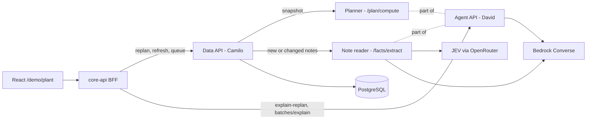

# UC1 — Semantic Optimizer: Technical Solution

**Owner:** David (Agent API) · **Data API / persistence:** Camilo · **BFF / UI:** Mauricio
**Status:** Draft for demo day (2 Oct 2026) · **Use case:** UC1 Plant Capacity Utilization (Pasco conditioning)

This document describes how the semantic optimizer works end to end: inputs, components, contracts, model usage, and delivery order. Database tables and migrations are out of scope here; Section 8 lists the *data the engine needs*, and Camilo owns how it is stored.

---

## 1. Summary

The semantic optimizer re-times the open process-order (PO) queue for each conditioning line every time something changes (new PO, priority change, rush, QA fail, line down). It answers three questions for the planner:

1. **What order should the lines run?** — ranked by the plant's own rule: SAP priority → species within priority → SAP finish date.
2. **What does this change break?** — which POs now finish after their SAP finish date, and how overloaded each line is per week.
3. **Why?** — a short, cited explanation in plain language.

Design rule: **models read and explain; code decides.** JEV and Bedrock turn free-text notes into typed facts and turn plan diffs into prose. A deterministic planner produces the order, the times and the impact. Every ID a model cites is validated against the plan diff, and template text is the fallback.

The brief asks for "a recommendation with an explanation, not a mathematically optimal schedule." The planner is therefore a transparent rule-based scheduler with constraint checks and minimal-move event handling, not a solver.

---

## 2. Scope

**In scope**

- Large-seed lines **Line 1 (LSVLN1)** and **Line 2 (LSVLN2)** planned together, including Gravity and Colorsort repair POs and Bayer third-party POs that consume their capacity.
- Small-seed **Line 5 (SSVLN5)** as a stretch, same engine with its own calendar.
- Events: SAP refresh (new POs), planner priority change, rush, QA fail, line down, scheduler override.
- Note reading (fumigation, QA wait, rush, hold/release), plan explanation, "explain my batch".

**Out of scope**

- Writes to SAP / ERP. Accept records a decision only.
- Customer orders and customer need-by dates in the ranking (the scheduler does not see them; the synthetic customer orders stay demo-only context).
- Global optimality, line assignment from scratch (POs arrive on a work center; the engine only proposes Line 1 ↔ Line 2 swaps).
- Handpick scheduling (manual, off the lines) — the engine only routes to it.

---

## 3. Confirmed business rules

From stakeholder answers (Sep 2026). These are inputs to the engine, not assumptions.

| Area | Rule |
| --- | --- |
| Ranking | Priority 1–9 (1 most urgent) → group same species within a priority → SAP finish date. POs without priority are placed to finish by their SAP finish date. |
| Lateness | A PO is late when its expected finish is after its **SAP finish date**. |
| Rush | Goes to the **next ideal opening** (run boundary), with a planner-supplied ship-by date. Interrupting a running species campaign is a rare, explicit scheduler override. |
| Changes | Most changes are planner priority moves up/down that re-time 20–30 finish dates. New POs land mid-schedule constantly. |
| Cleanout | Full cleanout on every species change, before every Excelis run, after every GMO run. Same-crop variety change is a short changeover. |
| GMO | GMO is never directly followed by non-GMO. A breaker PO (not GMO, not certified non-GMO) must run in between. |
| Line fit | Beans, peas, corn → LSV (Lines 1, 2). All other crops → SSV. |
| Hours | LSV: 24h Mon–Sat in harvest, reduced off-season. SSV: one 8h shift Mon–Fri. |
| Repair | Gravity and Colorsort are repair-PO schedules run **on Lines 1 and 2**. FM/AP fails → Gravity; dent/discoloration → Colorsort; too-sensitive seed → Handpick. Usually only a size fraction fails. |
| QA timing | QA results arrive ~2 weeks after the run. |
| Fumigation | ~3 days per cycle, 50–60k kg per cycle, processed in priority order. |
| Capacity | Bayer POs are third-party conditioning and count toward capacity. Main pain: more volume booked in SAP than lines can condition. |
| Metric | kg per hour. |

---

## 4. Architecture



**Key decisions**

1. **Only the Data API touches PostgreSQL.** The planner and note reader are stateless Agent API endpoints: snapshot in, result out. Data API persists results.
2. **The BFF contract does not change.** `POST /schedule/replan` and `POST /schedule/refresh-from-sap` keep their request/response shapes; internally the Data API builds the snapshot, calls `POST /plan/compute`, persists the plan version and returns the same `{ queue, planVersion, diff }`.
3. **Explanation stays a separate call** (`POST /explain-replan`, BFF → Agent) so a slow or failed model call never blocks a plan.
4. **Note reading happens at ingest, not at plan time.** Facts are extracted when a note is new or changed, cached by note hash + model version, and arrive in the snapshot already typed. The planner never calls a model.
5. **SAP / S/4 isolation.** All SAP-shaped parsing stays in the Data API ingest layer. The engine only sees normalized snapshot fields, so an S/4 migration changes ingest, not the engine.

> Decision to confirm with Camilo and Mauricio: Data API → Agent API `/plan/compute` call from inside `/schedule/replan`. The alternative (planner logic as SQL in gold functions) keeps fewer hops but puts the engine outside David's code and tests.

**Runtime:** Node 20 ESM Lambdas, Serverless Framework, `us-east-1`, following `LAMBDA-STANDARD.md` (handler validates → service → `serviceResponse`). Planner code is pure functions with no I/O so it runs identically in Lambda, Jest and the BFF stub.

---

## 5. Component design

### 5.1 Snapshot (built by Data API, consumed by planner)

One snapshot per **plant line group** (LSV = Lines 1 + 2; SSV = Line 5), not per line, because repair, Bayer and swaps share capacity across Lines 1 and 2.

Contents:

- Open POs: PO number, work center, material / species / variety, trait flags (GMO, certified non-GMO, Excelis), input kg (KS for SSV), SAP priority, SAP finish date, lot, parent PO / lot for repairs, PO type (standard, repair-gravity, repair-colorsort, Bayer).
- Running PO per line and its expected remaining hours.
- Typed facts per PO (from 5.2) with confidence and status.
- Run rates: historical kg/h by line × species (median of conditioning runs; fallback species median, then line median).
- Line calendar: weekly working pattern, season, downtime windows.
- Changeover rules: variety-change hours, cleanout hours, triggers.
- Scheduler overrides: locks, line swaps, manual positions, rush ship-by dates.
- Previous accepted/proposed plan for the line group (for minimal-move diffs).
- Active policy version.

### 5.2 Note reader (semantic layer)

Turns free-text SAP notes into typed facts. Runs on new or changed note text only.

**Fact types**

| Fact | Typical note | Planner effect |
| --- | --- | --- |
| `NOT_READY` / fumigation | "Needs fumi!!" | Earliest start = estimated fumigation completion |
| `NOT_READY` / QA wait | "Wait for raw germ" | Earliest start = test date + ~14 days (or known result date) |
| `RUSH` | "RUSH - Priority 1. For Export to NL" | Rush flag; ship-by date if present |
| `HOLD` / `RELEASE` | "CLN-2 ON HOLD" | Blocks / unblocks the PO |
| `DEADLINE` | "Needs to ship by 10/15" | Ship-by date |
| `INFO` / `NONE` | Everything else | No effect, kept for explanations |

**Pipeline**

1. **Normalize + hash** the note (trim, collapse whitespace, upper-case). Cache hit on `hash + modelId + promptVersion` → return stored fact.
2. **Regex pre-pass** for obvious cases (`RUSH`, `FUMI`, `HOLD`, dates). High-confidence hits skip the model.
3. **JEV classify** (primary): one call to the OpenRouter Decisions API (`POST https://openrouter.ai/api/alpha/decisions`, not chat completions) with the note as `state` and two Choice questions: `fact_type` (NOT_READY, HOLD, RELEASE, RUSH, DEADLINE, INFO) and `not_ready_reason` (FUMIGATION, RAW_GERM_PENDING, OTHER). The Choice `confidence` is the fact confidence; code turns the reason into `ready_by`. Measured on the 30 live notes: about 250 ms per note.
4. **Bedrock extract** (secondary): only when a value is needed (dates, kg, ship-by) or JEV is unavailable. Converse API with a JSON schema output; temperature 0.
5. **Confidence gate:** below the policy floor (default 0.70) → `NEEDS_CONFIRMATION`; the fact is shown in the UI but not applied until a person confirms.
6. **Return** typed fact with provider, model ID, prompt version and confidence.

**Ready-date estimation (code, not model)**

- Fumigation: queue fumigation-needed POs in priority order, pack into 50–60k kg cycles of ~3 days, earliest start = end of the PO's cycle.
- QA wait: test date + 14 days unless a result is already present.

### 5.3 Constraint checker

Hard constraints, evaluated on any candidate sequence. A violation is never traded off; the planner repairs it or reports it.

| ID | Constraint |
| --- | --- |
| C1 | Running PO stays first on its line. |
| C2 | No start before earliest-start (not-ready, hold, QA wait). |
| C3 | GMO → non-GMO forbidden; insert or pull a breaker PO, else report `NO_BREAKER_AVAILABLE`. |
| C4 | Line fit: LSV species only on Lines 1/2. |
| C5 | Scheduler locks and line assignments are fixed. |
| C6 | No production inside downtime windows. |

Cleanout triggers (species change, before Excelis, after GMO) are not constraints but **changeover costs** applied in 5.5.

### 5.4 Ranker

Lexicographic sort per line, matching the plant's rule:

1. Priority ascending (missing priority sorts after priorities, by SAP finish date).
2. Within a priority, group by species; species groups ordered by earliest SAP finish date in the group; continue the currently running species first.
3. Within a species group, by variety (to use short changeovers), then SAP finish date, then PO number (stable tie-break).

Then apply C1–C6 and the GMO breaker insertion. The ranker is used for the **baseline plan** (morning plan, full rebuild). Events use minimal moves (5.6).

### 5.5 Timeline simulator

Walks each line sequence on the line calendar:

```
start = max(previous end, earliest start, next calendar working time)
changeover = cleanout hours if (species change | next is Excelis | previous is GMO) else variety-change hours
run hours = input kg / kg-per-hour(line, species)
end = advance(start + changeover + run hours) through working windows, skipping downtime
slack = SAP finish date − end   → late if slack < 0
```

Outputs per PO: expected start/end, changeover type and hours, slack, late flag. Per line × ISO week: hours required (including repair and Bayer POs) vs hours available, load %.

### 5.6 Event handlers (minimal change)

Each handler starts from the previous plan, applies the smallest change consistent with the rule, re-runs 5.3 and 5.5, and emits reason codes.

| Event | Handling | Reason codes |
| --- | --- | --- |
| SAP refresh — new PO | Insert at the first position where priority, species group and SAP finish date fit; prefer joining an existing species run. | `NEW_PO_INSERTED`, `RETIMED` |
| SAP refresh — removed / completed PO | Drop it, close the gap. | `PO_REMOVED`, `RETIMED` |
| Priority change | Remove and re-insert by the rule; others only shift in time. | `PRIORITY_UP` / `PRIORITY_DOWN`, `RETIMED` |
| Rush | Candidate slots = run boundaries (end of current species run on each LSV line). Pick the earliest that meets ship-by; if none, earliest boundary + warning. Interruption only if a scheduler override says so. | `RUSH_NEXT_OPENING`, `RUSH_MISSES_SHIP_BY`, `RETIMED` |
| QA fail (completed PO) | Map fail reason → route (Gravity / Colorsort / Handpick). Propose a repair PO sized from the failed fraction; reserve tentative hours on the line used historically for that route. When the planner's real repair PO arrives via SAP refresh, link it to the parent lot and replace the reservation. | `REPAIR_PROPOSED`, `REPAIR_ROUTE_<X>`, `CAPACITY_RESERVED` |
| QA fail (queued PO) | If the fail is on raw seed for a PO not yet run, apply a `HOLD` fact. | `QA_HOLD` |
| Line down | Add downtime window; re-time; optionally propose moving POs to the other LSV line if it reduces late count (proposal only). | `LINE_DOWN`, `SWAP_PROPOSED`, `RETIMED` |
| Scheduler override | Apply lock / swap / manual position as given; re-time; flag constraint violations rather than undoing them. | `SCHEDULER_OVERRIDE` |

### 5.7 Impact

Computed on every plan version vs the previous one:

- Moves (PO, from position, to position, line).
- Re-timed POs and delta hours.
- **Newly late** and **no longer late** POs against SAP finish date.
- Weekly load per line (hours required / available) and overload hours.
- Planned throughput (kg/h) and changeover hours added/removed.

### 5.8 Explainer (Bedrock)

Input packet (from Data API `agent_context` or the replan response): event, diff, reason codes with parameters, facts used, impact, and the list of **citable IDs** (PO numbers, lots, lines).

- Bedrock Converse, Claude Sonnet 4.5 (`us.anthropic.claude-sonnet-4-5-20250929-v1:0`), temperature 0, JSON output matching `PlantExplanation { alertBanner, summary, bullets, impact }`.
- System prompt: plain planner language, ≤ 4 bullets, lead with what is late, cite only IDs from the packet, never invent numbers — use the impact fields verbatim.
- **Guard:** parse JSON; every PO/lot mentioned must be in the citable set and every number must match an impact field. On failure, retry once, then fall back to the reason-code templates (`explanationBuilder.js` behavior).
- **Explain my batch:** `POST /demo/plant/batches/explain` reads the latest plan (`gold.agent_context`, `gold.batch_detail`) for the selected PO and its two neighbors. JEV routes the question (`WHY_WAITING`, `WHEN_FINISH`, `MOVE_UP`, `OTHER`); the browser sends the last 4 turns so a follow-up can say "it". Bedrock phrases the answer when enabled. A PO that is not in that packet is rejected and the template is used. History stays in the browser.

### 5.9 Accept and override

- Accept: BFF → Data API records the decision, plan becomes accepted. No SAP write.
- Override: the UI sends a lock, swap or manual position. It is stored as an override (Data API) and becomes snapshot input for the next plan. The explainer names overrides explicitly ("kept at position 3 per scheduler").

---

## 6. API contracts (Agent API)

New internal endpoints called by the Data API. Existing `/explain-replan` and `/batches/explain` keep their shapes (`backend/docs/api/uc1-demo-response-examples.json`). OpenAPI goes under `backend/docs/api/`.

### `POST /plan/compute`

```json
{
  "lineGroup": "LSV",
  "mode": "event",
  "event": { "type": "priority_change", "po": "1002307551", "priority": 2 },
  "policyVersion": 1,
  "snapshot": { "asOf": "2026-10-02T06:00:00-07:00", "orders": [], "running": [], "facts": [], "rates": [], "calendar": [], "changeovers": [], "overrides": [] },
  "previousPlan": { "planVersion": 3, "entries": [] }
}
```

Response:

```json
{
  "planVersion": 4,
  "entries": [
    { "line": "line-2", "position": 1, "po": "1002307551", "start": "…", "end": "…", "changeover": { "type": "VARIETY", "hours": 1.0 }, "slackHours": 36.5, "late": false, "reasons": [{ "code": "PRIORITY_UP", "params": { "from": 5, "to": 2 } }] }
  ],
  "diff": { "moves": [], "reasons": [], "added": [], "removed": [], "held": [] },
  "impact": { "newlyLate": [], "noLongerLate": [], "weeklyLoad": [], "throughputKgPerHour": 0, "changeoverHoursDelta": 0 },
  "violations": [],
  "proposals": [{ "type": "REPAIR_PO", "parentPo": "…", "route": "COLORSORT", "kg": 0, "line": "line-2" }]
}
```

`mode: "baseline"` ignores `event` and `previousPlan` and runs the full ranker.

### `POST /facts/extract`

```json
{ "notes": [{ "sourceRef": "process_order:123:note", "po": "1002307551", "text": "Needs fumi!!" }], "promptVersion": "facts-v1" }
```

Response: one fact per note with `factType`, `value` (dates, kg), `appliesTo`, `confidence`, `status`, `provider`, `modelId`, `promptVersion`.

---

## 7. Model integration

| | JEV | Bedrock |
| --- | --- | --- |
| Role | Bounded classification (fact type, blocks-now, applies-to, question routing) | Value extraction, explanations, batch answers |
| Access | OpenRouter, model `typesafe/jev-1.13` (pinned) | Converse API, `us-east-1`, IAM role on the Lambda |
| Data sent | Note text + PO number only | Plan packet (no personal data) |
| Timeout | 3 s | 8 s explain, 5 s extract |
| Fallback | Regex → Bedrock extract | Retry once → templates |
| Cost | ~$0.04 / M input tokens | Per-call tokens; notes cached by hash |

- Secrets (OpenRouter key) in SSM Parameter Store / Secrets Manager; never in env files.
- JEV calls leave AWS: acceptable for hackathon data; feature-flag `JEV_ENABLED` to run Bedrock-only.
- Prompts versioned in code (`facts-v1`, `explain-v1`); version is stored with every fact and explanation for traceability.
- Every model call logs provider, model, prompt version, latency, token count, and guard result (no note text in logs beyond PO number).

---

## 8. What gold already gives the planner

Camilo's change is the lean handoff: [`uc1-gold-planner-handoff.md`](./uc1-gold-planner-handoff.md). Two inserts (`planner_rules`, policy version 2) and one branch in `gold.replan`: if `plan_event.payload.entries` is present, save those rows; otherwise keep the heuristic. No new tables, columns, or functions.

The planner reads what is already live:

- `gold.v_open_queue` for Lines 1 and 2, plus open `REPAIR` rows. Due date is `sap_finish_date`. Ignore `due_date` (that column is still the sheet finish).
- `gold.v_trusted_fact` for notes already tagged by `rules-v1`.
- `gold.changeover_rule` and `gold.v_throughput` for hours and kg/h.
- `gold.cfg('planner_rules')` for the calendar, cleanout triggers, the GMO pair, and repair routes.
- The latest `plan_event.payload` for `downtime`, `overrides`, and `proposals` left by the previous run.

The planner writes one payload per line. `entries` become `schedule_entry` rows. `impact`, `proposals`, `downtime`, and `overrides` stay JSON on the event. `event_response` is unchanged, so the queue and the diff still paint the UI. Impact and proposals travel with the payload the explainer already has.

---

## 9. Non-functional

- **Latency:** `/plan/compute` < 1 s for ~150 POs (pure in-memory). End-to-end replan < 2 s; explanation streamed after.
- **Determinism:** same snapshot + policy → same plan (stable tie-breaks, no randomness, no model calls in the planner).
- **Idempotency:** events carry an ID; replaying an event yields the same plan version.
- **Traceability:** each plan entry carries reason codes and the fact IDs it used; each explanation stores the packet hash and model ID.
- **Security:** IAM least privilege (Bedrock invoke only for the Agent role); OpenRouter key in SSM; no SAP writes.
- **Degraded mode:** models off → plan still computed, facts from regex/confirmed only, explanations from templates.

---

## 10. Testing

- **Unit (Jest):** ranker ordering, GMO breaker insertion, cleanout triggers, calendar walk across weekends and downtime, rush slot selection, repair routing, minimal-move diff.
- **Golden plans:** fixed snapshots from the RDS extract for Line 2 → expected sequences and late lists, reviewed with the planning SME.
- **Model contract tests:** fixture notes from the data (fumigation, germ wait, rush, hold) → expected fact type; guard tests with fabricated IDs must fall back.
- **Integration:** BFF → Data → Agent with stub URLs, then live; MSW and Cypress unchanged because BFF shapes are unchanged.

### 10.1 How to run it

Code lives in `backend/core-api/services/semanticEngine/` (engine) and `backend/core-api/services/plantDemo/semanticReplan.js` (BFF wiring).

**Unit tests** (no database):

```bash
cd backend && npm test   # tests/agent-api-planner.test.js, tests/semantic-engine.test.js
```

**Read-only smoke against gold** (from `backend/core-api`, with `PGHOST`/`PGUSER`/`PGPASSWORD`/`PGDATABASE` or `DATABASE_URL` set). Nothing is written unless `--save` is passed.

```bash
npm run semantic:smoke -- --notes                                   # baseline plan + note reader
npm run semantic:smoke -- --rush 1002303196 --ship-by 2026-10-02    # rush at the next species boundary
npm run semantic:smoke -- --qa-fail 9999999 --reason Discolored     # finished order -> COLORSORT proposal
npm run semantic:smoke -- --line-down line-2 --from 2026-09-29T08:00:00-07:00 --to 2026-09-29T20:00:00-07:00
npm run semantic:smoke -- --swap 1002303196 --to-line LSVLN1
npm run semantic:smoke -- --json                                    # full payloads as JSON
```

Add `BEDROCK_ENABLED=true` (AWS credentials with `bedrock:InvokeModel`) to get the model explanation instead of the template, and `JEV_ENABLED=true OPENROUTER_API_KEY=…` to let JEV read unclear notes.

**Lambdas** (`serverless offline` or deployed): `POST /plan/compute` (`{ "loadFromGold": true, "event": {...}, "save": false }`), `POST /facts/extract` (`{ "notes": [...] }`), `POST /explain-replan` (`{ "payload": {...} }`).

**End to end through the BFF:** set `SEMANTIC_PLANNER_ENABLED=true`. Pass/fail, priority change and new-order ingests then run the planner, save through `gold.replan`, and return the planner explanation. If `gold.replan` cannot read `payload.entries` yet, the BFF logs a warning and keeps the existing heuristic, so the flag is safe to turn on early.

**Gated on the gold handoff** (`uc1-gold-planner-handoff.md`): `--save`, `save: true` and the BFF path need the `replan` entries branch. `planner_rules` and policy v2 are optional for testing because the engine falls back to built-in defaults (Lines 1 and 2, Monday–Saturday, 24 hours).

**Known data behaviour:** repair orders on `LSVGRVTY` and `LSVCLSRT` are planned on Line 2 until their real line is known, and orders that are `ONLINE` there are not treated as running on Line 2. On the current extract, Line 2 is fully booked until early December and 18 orders finish after their SAP date, mostly rework orders (`2400…` and `3001…` POs) whose SAP finish dates are already in the past.

---

## 11. Delivery plan

Build the planner as a pure module under `backend/agent-api`. It does not talk to Postgres. A thin loader feeds it a snapshot; a thin writer turns its result into the payload in the handoff. Until Camilo's `replan` branch is applied, the same JSON drives the BFF in process. When the branch is in, the Data API stores that payload and calls `replan` once per line.

**1. Snapshot types and a Line 2 fixture.** One fixture copied from `v_open_queue`, trusted facts, changeover hours, and throughput. `dueDate` on the fixture is `sap_finish_date`.

**2. Ranker.** Priority ascending, nulls last. Inside a priority, one species at a time, continuing the species already running. Then SAP finish date, then PO number.

**3. Calendar, cleanouts, constraints.** Read the weekly pattern from `planner_rules`. Skip Sunday and any `downtime` windows copied from the last payload. Charge `SPECIES_CHANGE` hours on a species change, before Excelis (`trait_family_code`), and after a GMO fact. The running order stays first. Nothing starts before `fact_value.ready_by`. A GMO fact is never placed directly before a certified non-GMO fact. Unknown traits skip that rule.

**4. Timeline and impact.** Walk each line. Fill `entries` with the columns `replan` already inserts, `dueDate` = SAP finish date, and only existing reason codes. Fill `impact.newlyLate` and `impact.weeklyLoad` in the same payload.

**5. Events, still pure functions.** Each one starts from the previous entries and returns a new payload.

- New order or priority change: re-slot that order, re-time the rest.
- Rush: next species boundary that meets `shipBy`. If none does, take the earliest boundary and say so in the reason.
- QA fail on an order that is still queued: `entryStatus: "HOLD"`.
- QA fail on an order that is not in the queue: append `proposals[]` (`COLORSORT` for `DENT` and `DISCOLORED`). Do not invent a `schedule_entry`.
- Line down: append `downtime[]` and re-time.
- Line swap: put that order's entry on the other line's `entries` array. `replan` is still one call per line.

Copy `downtime`, `overrides`, and open `proposals` forward onto every new payload.

**6. Note reader, after the ranker works.** Regex first, then JEV, then Bedrock when a date or a quantity is needed. Save with `record_note_reading` as `reader = 'BEDROCK'`. JEV uses `model_id = 'typesafe/jev-1.13'`. Ready dates are computed in code and stored in `fact_value.ready_by`. Facts under 0.70 stay `NEEDS_CONFIRMATION` and are not applied.

**7. Explainer.** Bedrock writes `PlantExplanation` from the diff `event_response` already returns, plus `impact` and `proposals` from the payload. Reject any PO or number that is not in that packet, then fall back to the existing templates.

**8. Wire-up.** `POST /plan/compute` returns the payload. The Data API writes it onto `plan_event.payload` and calls `replan`. A second call with the same event id returns the saved plan. The heuristic path stays for events that have no `entries`.

**Demo, Line 2.** Morning plan. A new order lands and some finish dates slip past the SAP finish date. A rush waits for the next species boundary. A discoloration fail on a finished order shows up as a Colorsort proposal in the payload. A swap is that order moving onto Line 1's entries.

**Stretch.** Line 5, off-season hours, a weekly-load chart. Those do not need gold changes.

---

## 12. Risks

| Risk | Mitigation |
| --- | --- |
| Run-rate data sparse for some species | Fallback chain (line × species → species → line); show "estimated" in UI |
| GMO / certified non-GMO flags missing in data | Treat unknown as "not breaker-eligible"; surface `NO_BREAKER_AVAILABLE` |
| JEV availability (signup closed, external) | OpenRouter access + `JEV_ENABLED` flag; Bedrock-only path |
| Model invents IDs or numbers | Guard + template fallback |
| Data API wiring slips | BFF stub mode keeps the demo running on in-process planner |
| Repair routes beyond FM/AP/dent/discolor unknown | Mark as assumption, ask the planner to confirm in UI |

---

## 13. Open questions (planning SME)

1. What FM and AP stand for; repair route for COB, BROKEN, SMUT, OFF_TYPE, WEED, INERT.
2. How certified non-GMO and breaker-eligible POs are identified in SAP data.
3. How a repair PO is assigned to Line 1 vs Line 2.
4. Off-season working hours for LSV lines.
5. Whether fumigation has its own schedule or data source.
6. Why Line 5 priorities go above 9 (up to 18).
7. SSV units (KS) and a usable throughput metric for Line 5.

---

## 14. References

- `docs/hackathon/uc1-gold-planner-handoff.md` — the only gold change Camilo makes
- `docs/hackathon/syngenta-demo-architecture.md` — overall architecture and owners
- `docs/hackathon/uc1-bff-data-agent-route-map.md` — BFF ↔ Data ↔ Agent routes
- `docs/hackathon/uc1-mvp-scope.md` — MVP scope
- `backend/data-model/uc1-data-model.md` — data model and ingest
- `backend/core-api/services/plantDemo/` — current BFF stub, template explanations
- `frontend/src/demo/plant/plantDemoTypes.ts` — UI response shapes
