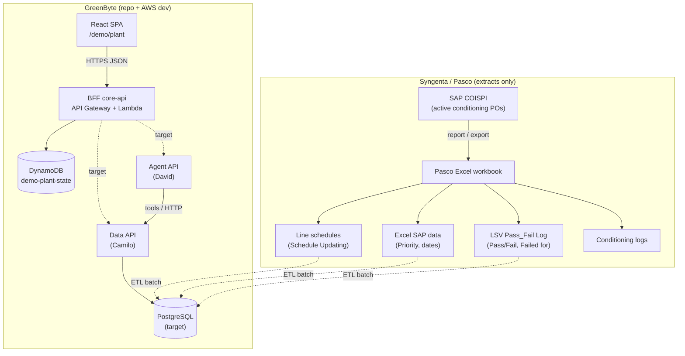
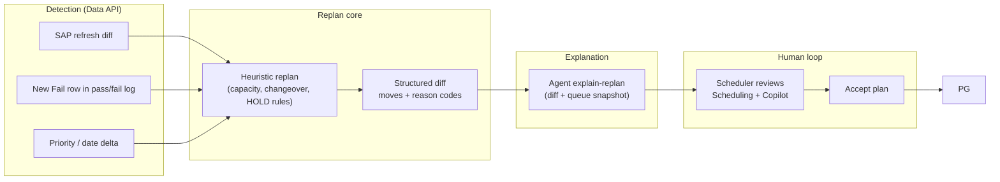
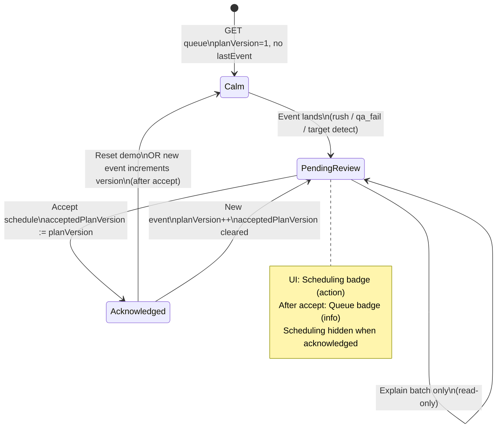
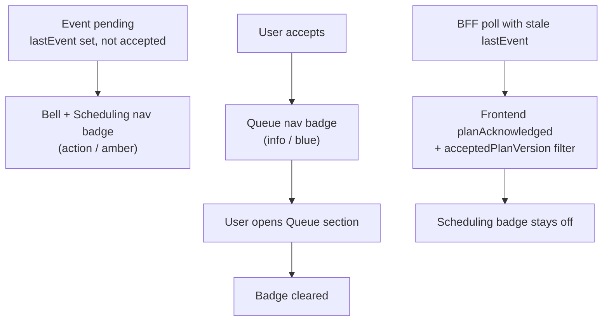
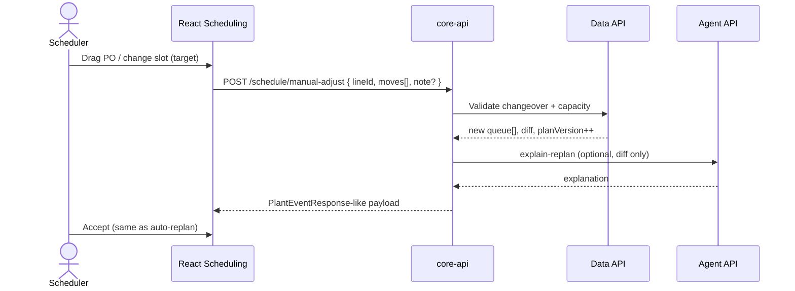
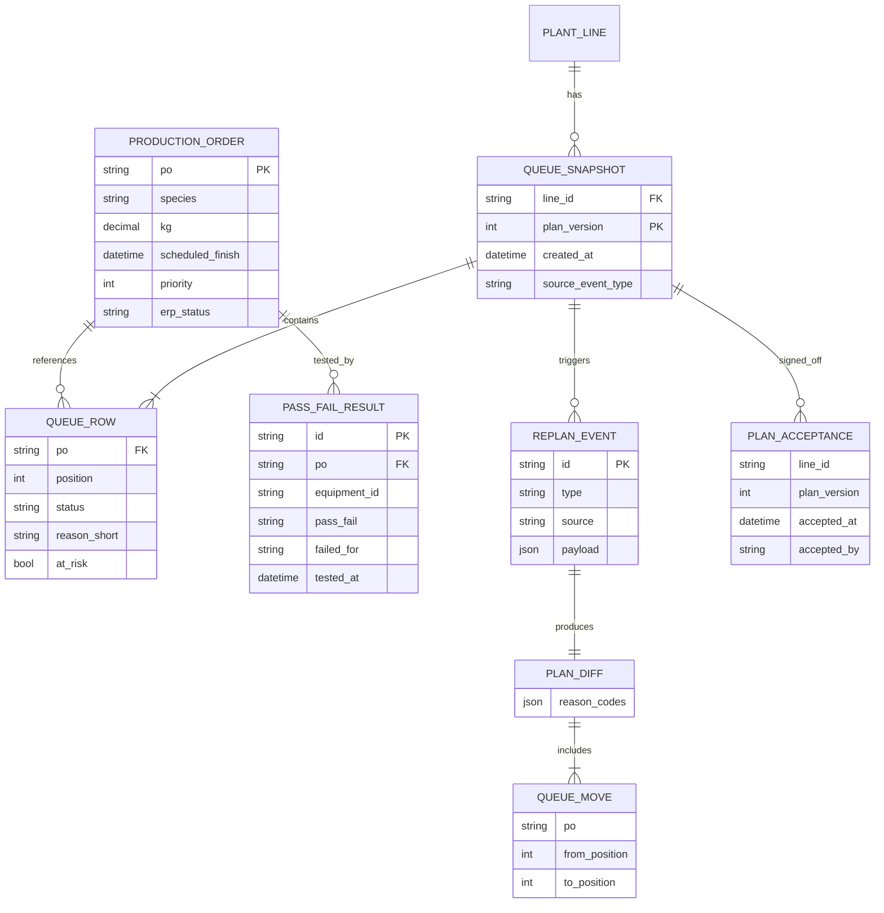
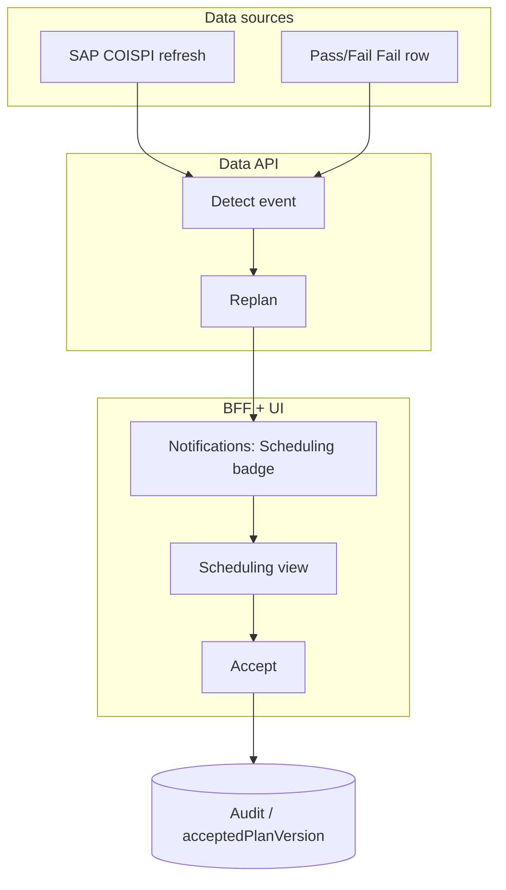
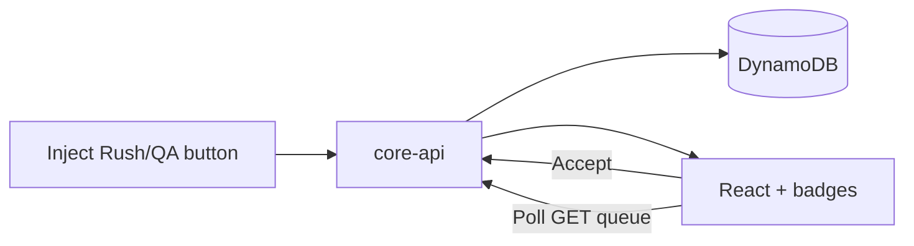

# UC1 Plant Scheduling — System Blueprint (architecture, events, decisions, AI data model)

**Purpose:** One place to see **systems**, **data sources**, **events**, **human decisions**, and how they affect **queue**, **scheduling**, and **notifications** — aligned with Syngenta UC1 and Pasco extracts. Includes a **logical data model** for Data API and Agent API (Camilo / David).  
**Audience:** Product, backend, data, and AI engineers.  
**Status:** Hackathon **B+** demo; production paths marked **target**.

**Related:** [uc1-syngenta-assumptions.md](./uc1-syngenta-assumptions.md) · [syngenta-demo-architecture.md](./syngenta-demo-architecture.md) · [uc1-ui-backend-flow.md](./uc1-ui-backend-flow.md) · [UC1-SYNGENTA-DEMO-CONTEXT.md](../../backend/docs/api/UC1-SYNGENTA-DEMO-CONTEXT.md)

---

## 1. What we have today vs what we expect

| Layer | **Today (repo / deployed dev)** | **Target (Syngenta-aligned product)** |
| --- | --- | --- |
| **UI** | React `/demo/plant` — Dashboard, Queue, Scheduling (Gantt + “What changed”), Copilot, bell notifications | Same UX; optional manual drag on Gantt (**target**) |
| **BFF** | `core-api` Lambda — `/demo/plant/*`; queue state in **DynamoDB** (`demo-plant-state`) | Orchestrates Data + Agent; audit accept / overrides |
| **Data API** | Stubbed inside BFF logic / MSW; no live PG yet | ETL from Pasco Excel → **PostgreSQL**; replan rules; event detection from extracts |
| **Agent API** | Template `explanation` in BFF/MSW | **RAG** on structured diff + queue facts only (`explain-replan`, batch Q&A) |
| **Sources** | Synthetic queue + **inject buttons** simulating rush / QA | **SAP COISPI refresh**, **LSV Pass_Fail Log**, SAP priority/dates, customer orders (**gap**) |
| **ERP write** | None | None (human accepts; no auto SAP post) |

---

## 2. General architecture (systems and data)

### 2.1 Context — external sources (not live-connected in hackathon)



### 2.2 Application responsibilities

| System | Role | Owns |
| --- | --- | --- |
| **React UI** | Scheduler workspace; inject (demo); accept; read-only sales explain | Presentation, nav badges, section state (local) |
| **BFF (`core-api`)** | Single contract to browser; auth boundary; orchestration | `PlantQueueResponse`, `PlantEventResponse`, accept audit, demo reset |
| **Data API** | Truth for queue, rules, diffs, source events | Replan heuristics, ETL freshness, `planVersion`, row-level reasons |
| **Agent API** | NL explanations grounded in JSON | `PlantExplanation`, batch Q&A citations — **no invented POs** |
| **DynamoDB (today)** | Hackathon persistence for shared demo queue | `queue`, `planVersion`, `lastEvent`, `acceptedPlanVersion` |
| **PostgreSQL (target)** | Normalized Pasco + derived schedule state | POs, lines, pass/fail rows, plan snapshots, audit |

**Rule:** Browser calls **BFF only** (CORS, secrets, MSW parity).

---

## 3. Data sources → canonical events

Pasco operational pattern is documented in [uc1-syngenta-assumptions.md](./uc1-syngenta-assumptions.md). Below: **what generates an event** in the target model.

| Source (sheet / system) | Signal | Canonical event type | “New” in queue sense? |
| --- | --- | --- | --- |
| **SAP COISPI → schedule refresh** | New **active, non-complete** PO appears on line schedule | `queue_refresh` → may include **`rush_new_po`** if urgency rules fire | **Yes** — new row in active list |
| **SAP COISPI / Excel SAP data** | **Priority** or **scheduled finish** change on existing PO | `priority_change` → often **`rush_repriority`** | No — same PO, new urgency |
| **LSV Pass_Fail Log** | Row with **`Pass/Fail = Fail`**, PO on active line | **`qa_fail`** (with `failed_for` code) | No — test result on batch already on schedule |
| **Open customer orders** (brief input) | Demand pull on finish dates | **`demand_pressure`** (feeds ranking reasons) | **Gap** in demo |
| **Demo inject (hackathon)** | UI button / `POST /demo/plant/events` | `rush` \| `qa_fail` | Simulates landing of rush or fail — not production trigger |

### 3.1 Event → processing pipeline (target)



**Today:** inject skips detection; BFF applies fixed rules in `plantDemo/logic.js` and template explanation.

---

## 4. Event effects — queue, scheduling, copilot

| Event | Queue (`queue[]`) | Scheduling (Gantt / timeline) | Copilot / explain | `planVersion` |
| --- | --- | --- | --- | --- |
| **`rush` / rush_repriority** | Reorder rows; update `reasonShort` on moved POs; optional `atRisk` | Slots reflect new order; highlight moved PO | Rush narrative (priority, finish window, changeover) | Increment |
| **`qa_fail`** | Failed PO → **`HOLD`**; often moved out of active slot (e.g. tail); downstream positions shift | HOLD batch excluded or shown isolated; remaining line compressed | Fail reason from log (`Failed for`) | Increment |
| **`queue_refresh` (target)** | Add/remove/reconcile rows vs COISPI; drop complete/blocked | Rebuild timeline from new list | Optional summary of “what changed since last refresh” | Increment or snapshot id |
| **Accept** | **No ERP write**; queue rows unchanged | Same plan, marked acknowledged | Event chrome hidden | Same; `acceptedPlanVersion` set |
| **Reset (demo)** | Baseline seed | Baseline Gantt | Cleared | Reset to 1 |
| **Explain batch (read-only)** | **No change** | **No change** | Answer + citations for one PO | Unchanged |

### 4.1 Demo PO anchors (Syngenta/Pasco)

| Inject | PO | Pasco anchor |
| --- | --- | --- |
| Rush (stub) | `1002307551` | Priority 2, finish `2026-07-06` story |
| QA fail (stub) | `1001884747` | **Fail / Dent**, Line 1 in pass/fail log |

Do **not** use **`1001858227`** as QA fail — **Pass** in historical log ([uc1-syngenta-assumptions.md §2.3](./uc1-syngenta-assumptions.md)).

---

## 5. Planner decisions and system state

### 5.1 Plan lifecycle (state machine)

States are per **`lineId`** (demo: `line-1`). Notifications derive from **`lastEvent`**, **`accepted`**, and **`planAcknowledged`** (frontend ack vs `acceptedPlanVersion`).



| State | `lastEvent` (API) | User sees | Scheduling section | Accept button |
| --- | --- | --- | --- | --- |
| **Calm** | null | Green “calm” status | Timeline only | Hidden |
| **Pending review** | `rush` \| `qa_fail` | Amber alert, “What changed”, Gantt diff | Full layout + footer accept | Enabled |
| **Acknowledged** | null (filtered when `acceptedPlanVersion === planVersion`) | Accepted note; queue updated | No pending event chrome | Disabled / hidden |

### 5.2 Decisions the scheduler can take

| Decision | API / action | Effect on queue | Effect on scheduling | Notifications | Data sources |
| --- | --- | --- | --- | --- | --- |
| **Review replan** | Open **Scheduling** nav | None | View Gantt + diff | Clears **Scheduling** action badge when section opened (same session) | — |
| **Accept plan** | `POST .../schedule/accept` | Rows stay; audit only | Plan frozen for this version | **Scheduling** off; **Queue** info badge until user opens Queue | BFF persists `acceptedPlanVersion`; no SAP write |
| **Inspect queue** | Open **Queue** | None | None | Clears **Queue** unread badge | — |
| **Ask copilot** | `POST .../batches/explain` | None | None | No badge change | Agent reads queue/batch facts |
| **Reject / edit (target)** | Not in demo contract | Would revert or apply **manual order** | Manual slots | New **`manual_adjust`** event (**target**) | New plan version + reasons |
| **Reset demo** | `POST .../reset` | Baseline rows | Baseline timeline | All badges off | DynamoDB / seed reload |
| **Inject rush/QA (demo)** | `POST .../events` | Replan per rules | New diff | **Scheduling** action badge | Simulates SAP/log signal |

### 5.3 Notification model (UI)



| Badge | Meaning | Cleared when |
| --- | --- | --- |
| **Scheduling (action)** | Rush/QA awaiting review | User opens Scheduling **or** accept **or** `planAcknowledged` |
| **Queue (info)** | Plan accepted — review new order | User opens Queue |
| **Bell count** | Sum of above (demo mode) | Per section rules |

---

## 6. Manual schedule adjustment (target — not fully built)

Syngenta expects **human in the loop** before ERP. Manual adjustment is the path when the scheduler **disagrees** with the AI/heuristic plan.

### 6.1 Intended flow



| Topic | Behavior |
| --- | --- |
| **Trigger** | Explicit user edit, not SAP/log |
| **Queue** | New order; `reasonShort` includes `manual_override` or user note |
| **Scheduling** | Gantt reflects manual order; diff vs previous `planVersion` |
| **Notifications** | Treat like new pending plan until **Accept** |
| **Sources** | Does **not** mutate SAP or Excel; optional export for planners |
| **AI** | Agent explains **what changed** from prior plan; must cite POs from diff |

**Today:** no manual drag API; only inject + accept + reset.

---

## 7. Logical data model (for Data API + AI)

This model supports **replan**, **audit**, **event detection**, and **grounded** Agent responses. Types align with [`plantDemoTypes.ts`](../../frontend/src/demo/plant/plantDemoTypes.ts).

### 7.1 Entity-relationship (logical)



### 7.2 Core entities (fields for implementation)

#### `production_order` (from SAP / Excel SAP data)

| Field | Use in replan / AI |
| --- | --- |
| `po` | Stable id; citations |
| `species` / variety / size fraction | Changeover grouping |
| `kg` | Capacity display |
| `scheduled_finish` | Rush / at-risk narrative |
| `priority` | Rush detection |
| `erp_status` | Exclude complete/blocked from active queue |

#### `pass_fail_result` (from LSV Pass_Fail Log)

| Field | Use |
| --- | --- |
| `pass_fail` | `Fail` → **`qa_fail`** candidate |
| `failed_for` | Explanation bullets (Dent, Discolored, …) |
| `equipment_id` | Line scope filter |
| `po` | Join to active queue row |

#### `queue_snapshot` + `queue_row` (runtime schedule)

| Field | Use |
| --- | --- |
| `line_id` | e.g. `line-1` |
| `plan_version` | Monotonic; pairs with accept |
| `position` | Ranked order |
| `status` | `PLANNED` \| `HOLD` \| `COMPLETE` |
| `reason_short` | Per-row UI + Agent grounding |
| `previous_position` | Diff / moves |

#### `replan_event` (audit + detection)

| Field | Use |
| --- | --- |
| `type` | `rush` \| `qa_fail` \| `queue_refresh` \| `manual_adjust` |
| `source` | `sap_refresh` \| `pass_fail_log` \| `demo_inject` \| `ui_manual` |
| `payload` | Raw ids (PO, log row id, sap delta hash) |
| `created_at` | Ordering / idempotency |

#### `plan_diff` (Agent input — **critical for AI**)

| Field | Use |
| --- | --- |
| `moves[]` | `{ po, fromPosition, toPosition }` |
| `reasons[]` | Machine codes → Agent maps to NL (`priority_2`, `qa_fail_pass_fail_log`, …) |
| `held_pos[]` | POs set to HOLD |

**Agent contract:** Input = **`queue` snapshot + `diff` + `locale`**; output = **`PlantExplanation`** only. Forbidden: invent POs, dates, or fail codes not in payload.

### 7.3 API shapes ↔ persistence (today’s Dynamo item)

| API field | Dynamo / logical |
| --- | --- |
| `PlantQueueResponse.queue` | `queue[]` |
| `planVersion` | `planVersion` |
| `lastEvent` | Derived: `lastEvent` unless `acceptedPlanVersion === planVersion` |
| `acceptedPlanVersion` | `acceptedPlanVersion` |
| `PlantEventResponse` | Transient; persists as new snapshot + `lastEvent` |
| `PlantAcceptResponse` | Writes acceptance; clears pending event semantics |

### 7.4 Suggested Agent context document (per replan)

Store or assemble a JSON blob for RAG (no free-text DB scrape):

```json
{
  "lineId": "line-1",
  "planVersion": 2,
  "event": { "type": "qa_fail", "source": "pass_fail_log", "po": "1001884747", "failedFor": "Dent" },
  "queue": ["..."],
  "diff": { "moves": ["..."], "reasons": ["qa_fail_pass_fail_log", "isolate_hold", "resequence_downstream"] },
  "constraints": { "changeover": "species", "capacity": "line-1-finite" },
  "locale": "en"
}
```

---

## 8. End-to-end flows (summary diagrams)

### 8.1 Production-intent (target)



### 8.2 Hackathon demo (current)



---

## 9. UC4 and platform (reference)

UC4 (breeding) shares the **same container** (React → BFF → Data + Agent → PG) with different sources and routes. See [syngenta-demo-architecture.md §8](./syngenta-demo-architecture.md).

---

## 10. Document map

| Question | Read |
| --- | --- |
| Pasco sheets, PO anchors, “can event be new?” | [uc1-syngenta-assumptions.md](./uc1-syngenta-assumptions.md) |
| UX action → BFF call → JSON | [uc1-ui-backend-flow.md](./uc1-ui-backend-flow.md) |
| BFF owners, PO numbers, examples | [UC1-SYNGENTA-DEMO-CONTEXT.md](../../backend/docs/api/UC1-SYNGENTA-DEMO-CONTEXT.md) |
| TypeScript contract | [plantDemoTypes.ts](../../frontend/src/demo/plant/plantDemoTypes.ts) |
| Interactive step map | `/demo/plant/flow` on deployed frontend |

---

## 11. Changelog

| Date | Change |
| --- | --- |
| 2026-09-30 | Initial blueprint: architecture, sources → events, decisions, notifications, manual adjust target, AI data model |
