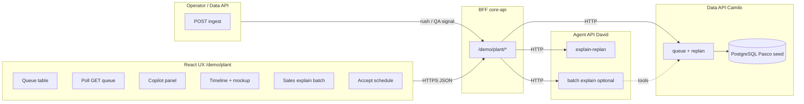
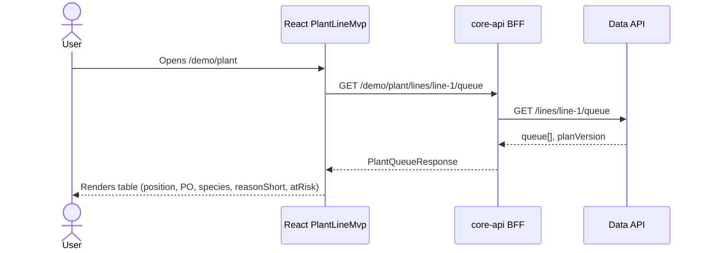
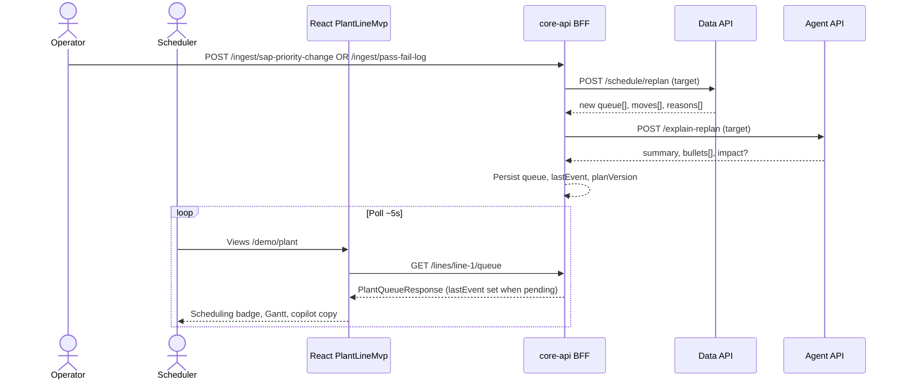
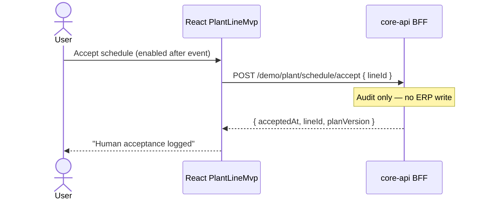
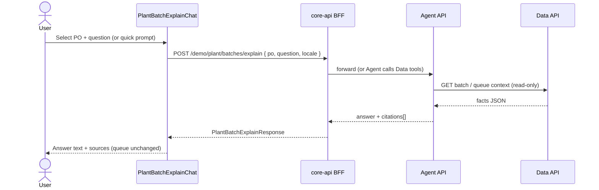

# UC1 — UI/UX to backend connection (Pasco Line 1)

**Route:** `/demo/plant`  
**Contract types (frontend):** `frontend/src/demo/plant/plantDemoTypes.ts`  
**Client:** `frontend/src/services/plantDemoApi.ts`  
**Target BFF:** `core-api` (`/demo/plant/*`)  
**Related:** [uc1-mvp-scope.md](./uc1-mvp-scope.md) · [syngenta-demo-architecture.md](./syngenta-demo-architecture.md) §7 · **Live UI ↔ API:** `/demo/how-it-works?section=api` (`/demo/plant/flow` redirects and keeps `step`) · **Backend dev brief:** [../../backend/docs/api/UC1-SYNGENTA-DEMO-CONTEXT.md](../../backend/docs/api/UC1-SYNGENTA-DEMO-CONTEXT.md)

The **browser calls only the BFF**. The BFF calls **Data API (Camilo)** and **Agent API (David)**. Today, if `VITE_API_BASE_APP` is unset, the same JSON is served by `plantDemoServer` on the client for static demo; production target is live BFF.

---

## 1. Container — who talks to whom

---

## 2. UX action → API call → what the user sees

| # | User action (UX) | When (moment) | Frontend calls BFF | BFF orchestration (target) | Backend response → UI binding |
| --- | --- | --- | --- | --- | --- |
| 1 | Open `/demo/plant` | Page load | `GET /demo/plant/lines/line-1/queue` | Proxy Data `GET /lines/line-1/queue` | **`queue[]`**, `planVersion` → table rows, status badges, “calm” state |
| 2 | Operator posts **SAP priority** ingest (not a UI button) | Live demo | `POST /demo/plant/ingest/sap-priority-change` | Data replan → simulated Agent explain | UI **polls** GET queue → proposed `queue`, `pendingDiff`, `pendingExplanation` |
| 3 | Operator posts **pass/fail Fail** ingest | Live demo | `POST /demo/plant/ingest/pass-fail-log` | Hold + resequence rules | Same; HOLD status, copilot QA copy |
| 4 | Click **Accept schedule** | After event | `POST /demo/plant/schedule/accept` `{ lineId }` | `gold.accept_plan` | **`acceptedAt`**, `planVersion` → confirmation note. No SAP write. |
| 5 | **What changed** | Scheduling picture after a scripted replan | No browser call | Agent `POST /explain-replan` (simulated) | **`explanation`** bullets on the copilot panel |
| 6 | Sales: pick PO + **Ask** | Anytime (nice-to-have) | `POST /demo/plant/batches/explain` `{ po, question, locale }` | Agent answers from the current queue | **`answer`**, **`citations[]`** → chat panel (no queue change) |
| — | UI **poll** (BFF or MSW) | Every ~5s while `/demo/plant` open | `GET /demo/plant/lines/{lineId}/queue?locale=` | While a plan is **PROPOSED**: `gold.event_response` plus simulated `POST /explain-replan`. Otherwise `gold.v_open_queue`. | `queue[]`, `reasonShort`, `pendingDiff`, `pendingExplanation` |

**Tour (`/demo/plant/tour`):** read-only **same React components**; no live HTTP (uses `plantFlowSnapshots`).  
**Backend owners per step:** see `/demo/how-it-works?section=api` → **Likely backend owners** (Mauricio · BFF, Camilo · Data API, David · Agent API).

---

## 3. Sequence — page load (queue)

---

## 4. Sequence — upstream data → replan (main demo)

**Important:** The scheduler UI calls ingest only through the operator API, not from a rush button. The Agent must not invent POs or dates; it paraphrases **`moves`** and **`reasons`** from Data (and optional tool JSON).

---

## 5. Sequence — accept plan (human in the loop)

---

## 6. Sequence — explain my batch (sales)

---

## 7. Request / response JSON (BFF)

**Canonical file (copy into Postman, contract tests, OpenAPI samples):** [../../backend/docs/api/uc1-demo-response-examples.json](../../backend/docs/api/uc1-demo-response-examples.json)

**Live in app:** `/demo/how-it-works?section=api` → pick a step → request example, then response JSON (same shapes). `/demo/plant/flow?step=` redirects and keeps the step.

Types: `frontend/src/demo/plant/plantDemoTypes.ts` · mock: `plantDemoServer.ts` · MSW: `plantDemoHandlers.ts`.

### `GET /demo/plant/lines/line-1/queue` → `PlantQueueResponse`

Six rows (5 active + 1 `COMPLETE`). Baseline `planVersion: 1`, optional `lastEvent`, `acceptedPlanVersion` after accept. Full array in JSON file → `GET .../queue.response200`.

### `POST /demo/plant/ingest/sap-priority-change` → `PlantEventResponse`

**Request (demo):** see `PlantIngestSapPriorityRequest` in `plantDemoTypes.ts`. Full example in JSON file → `response200Rush` (+ `source: "sap_priority_change"`).

**Response (200, rush)** — PO `1002307551` moves 3→1; same body as legacy rush event.

### `POST /demo/plant/ingest/pass-fail-log` → `PlantEventResponse`

**Request (demo):** see `PlantIngestPassFailRequest`. Full example in JSON file → `requestPassFailIngest` / `response200QaFail` (+ `source: "pass_fail_log"`).

**Response (200, qa_fail)** — PO `1001884747` → `status: "HOLD"`, moved to end of list.

**Errors (ingest):** `400` wrong PO or `passFail` not `Fail` · `404` `{ "message": "Unknown line" }`.

### `POST /demo/plant/batches/explain` → `PlantBatchExplainResponse`

Sales nice-to-have. **Request:** `{ "po", "question", "locale" }`. **Response:** `{ "po", "answer", "citations[]" }`. Does not change the queue. UI: `/demo/how-it-works?section=api&step=07`.

### `POST /demo/plant/schedule/accept` → `PlantAcceptResponse`

**Request:** `{ "lineId": "line-1" }`  
**Response:** `{ "acceptedAt": "<ISO-8601>", "lineId": "line-1", "planVersion": 2 }` (example timestamp in JSON file). With the database connected, this calls `gold.accept_plan`.

### Internal (BFF only — not browser)

Data replan fragment and Agent `explain-replan` input/output sketches: `uc1-demo-response-examples.json` → `internalServices`.

---

## 8. Deployment modes

| Mode | `VITE_API_BASE_APP` | Behaviour |
| --- | --- | --- |
| Static demo (current default) | empty | `plantDemoServer` in browser — same JSON shapes |
| Dev with MSW | set + `VITE_USE_MSW=true` | MSW handlers mimic BFF |
| Hackathon target | BFF URL on API Gateway | BFF calls Camilo + David URLs from env/SSM |

---

## 9. Team handoff checklist

| Owner | Must expose |
| --- | --- |
| Mauricio | All `/demo/plant/*` routes above; compose Data + Agent responses |
| Camilo | Queue + replan returning `moves` / `reasons` |
| David | `explain-replan` (+ optional batch explain) grounded in structured input |
