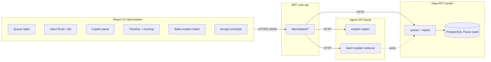
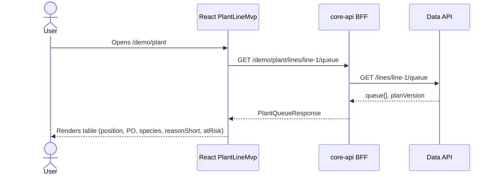
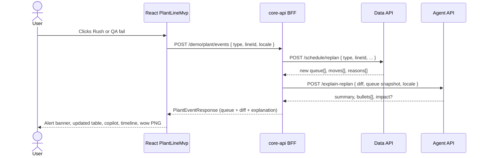
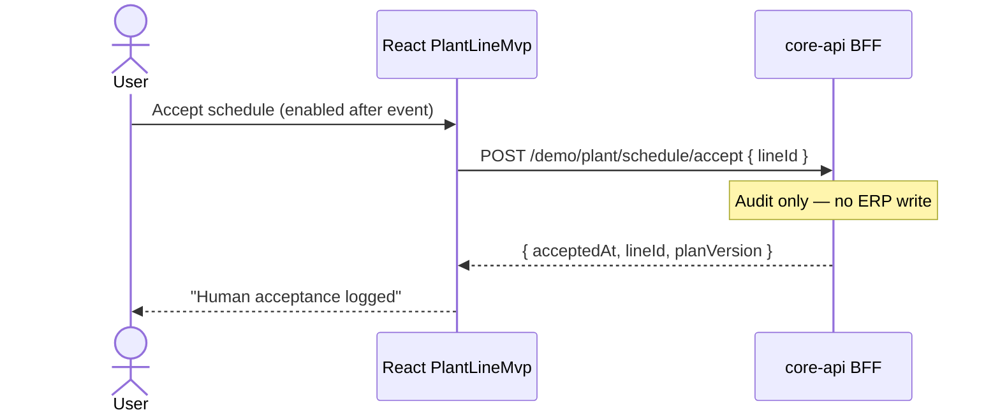
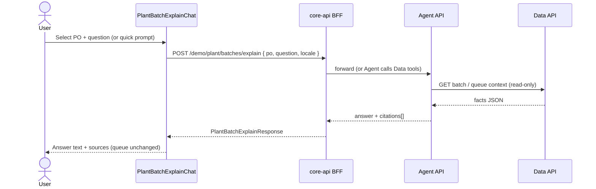

# UC1 — UI/UX to backend connection (Pasco Line 1)

**Route:** `/demo/plant`  
**Contract types (frontend):** `frontend/src/demo/plant/plantDemoTypes.ts`  
**Client:** `frontend/src/services/plantDemoApi.ts`  
**Target BFF:** `core-api` (`/demo/plant/*`)  
**Related:** [uc1-mvp-scope.md](./uc1-mvp-scope.md) · [syngenta-demo-architecture.md](./syngenta-demo-architecture.md) §7 · **Live UI ↔ API:** `/demo/plant/flow` (React + `plantDemoServer` snapshots)

The **browser calls only the BFF**. The BFF calls **Data API (Camilo)** and **Agent API (David)**. Today, if `VITE_API_BASE_APP` is unset, the same JSON is served by `plantDemoServer` on the client for static demo; production target is live BFF.

---

## 1. Container — who talks to whom



---

## 2. UX action → API call → what the user sees

| # | User action (UX) | When (moment) | Frontend calls BFF | BFF orchestration (target) | Backend response → UI binding |
| --- | --- | --- | --- | --- | --- |
| 1 | Open `/demo/plant` | Page load | `GET /demo/plant/lines/line-1/queue` | Proxy Data `GET /lines/line-1/queue` | **`queue[]`**, `planVersion` → table rows, status badges, “calm” state |
| 2 | Click **Simulate rush batch** | Live demo inject | `POST /demo/plant/events` `{ type: "rush", lineId, locale }` | Data `POST /schedule/replan` → Agent `POST /explain-replan` with diff | **`PlantEventResponse`**: new `queue[]`, `diff.moves[]` (highlight rows), `explanation.*` → banner + copilot, timeline + wow image |
| 3 | Click **Simulate QA failure** | Live demo inject | Same with `type: "qa_fail"` | Same pipeline; replan rules differ (hold + resequence) | Same shape; HOLD status, copilot QA copy |
| 4 | Click **Accept schedule** | After event | `POST /demo/plant/schedule/accept` `{ lineId }` | Log acceptance (BFF or Data audit table) | **`acceptedAt`**, `planVersion` → disabled accept button + confirmation note |
| 5 | Click **Reset queue** | Repeat demo | `POST /demo/plant/reset` `{ lineId }` | Reset demo state / reload baseline seed | Fresh **`queue[]`**, clear copilot & timeline |
| 6 | Sales: pick PO + **Ask** | Anytime (nice-to-have) | `POST /demo/plant/batches/explain` `{ po, question, locale }` | Agent (+ Data tools for batch/queue context) | **`answer`**, **`citations[]`** → chat panel (no queue change) |

**Tour (`/demo/plant/tour`):** no backend calls — narrative only.  
**Backend owners per step:** see `/demo/plant/flow` → **Likely backend owners** (Mauricio · BFF, Camilo · Data API, David · Agent API).

---

## 3. Sequence — page load (queue)



---

## 4. Sequence — inject rush or QA (main demo)



**Important:** The Agent must not invent POs or dates; it paraphrases **`moves`** and **`reasons`** from Data (and optional tool JSON).

---

## 5. Sequence — accept plan (human in the loop)



---

## 6. Sequence — explain my batch (sales)



---

## 7. Response payloads (summary)

### `GET .../queue` → `PlantQueueResponse`

```json
{
  "lineId": "line-1",
  "planVersion": 1,
  "queue": [
    {
      "po": "1002307551",
      "species": "SWCO",
      "kg": 2800,
      "finish": "2026-07-06 09:00",
      "status": "PLANNED",
      "atRisk": true,
      "reasonShort": "Priority 2 — customer window"
    }
  ]
}
```

### `POST .../events` → `PlantEventResponse`

```json
{
  "lineId": "line-1",
  "eventType": "rush",
  "planVersion": 2,
  "queue": [ "..." ],
  "diff": {
    "moves": [{ "po": "1002307551", "fromPosition": 3, "toPosition": 1 }],
    "reasons": ["priority_2", "sap_finish_2026-07-06", "same_species_changeover"]
  },
  "explanation": {
    "alertBanner": "Event injected: Rush batch — customer window at risk.",
    "summary": "...",
    "bullets": ["..."],
    "impact": "..."
  }
}
```

### `POST .../batches/explain` → `PlantBatchExplainResponse`

```json
{
  "po": "1001858227",
  "answer": "PO ... is position 2 ...",
  "citations": ["PO 1001858227", "Line 1 queue v2", "2026-07-05 16:00"]
}
```

---

## 8. Deployment modes

| Mode | `VITE_API_BASE_APP` | Behaviour |
| --- | --- | --- |
| Static demo (current default) | empty | `plantDemoServer` in browser — same JSON shapes |
| Dev with MSW | set + `VITE_USE_MSW=true` | MSW handlers mimic BFF |
| Hackathon target | BFF URL on API Gateway | BFF calls Camilo + David URLs from env/SSM |

---

## 9. Team handoff checklist

| Owner | Must expose |
| --- | --- |
| Mauricio | All `/demo/plant/*` routes above; compose Data + Agent responses |
| Camilo | Queue + replan returning `moves` / `reasons` |
| David | `explain-replan` (+ optional batch explain) grounded in structured input |
